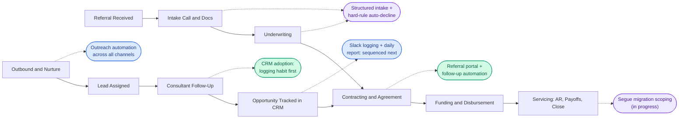
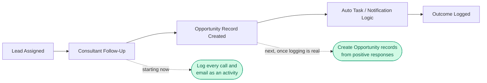
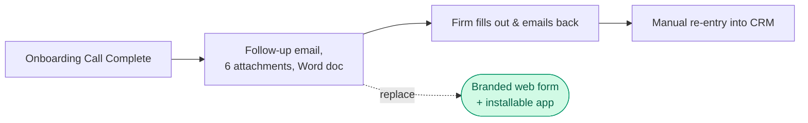
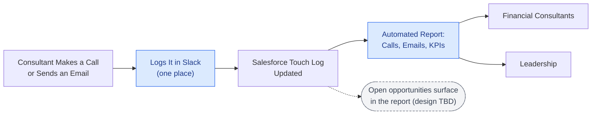
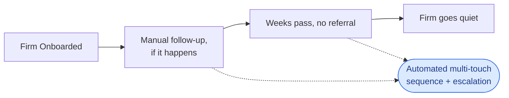
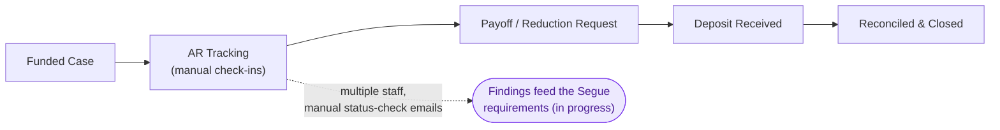
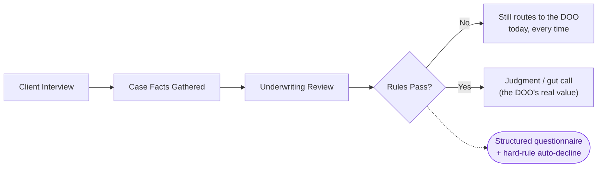
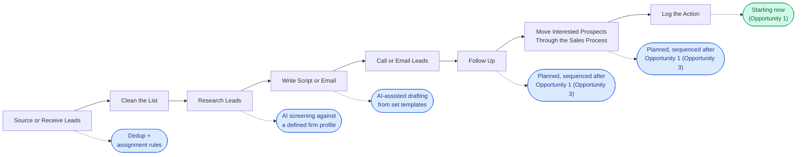

# Capital Financing — AI & Automation Opportunity Map

## What this document is for

This maps where automation and AI can move the needle at Capital Financing, ranked by effort and impact.

It comes from eight weeks of discovery: process mapping across every department, plus direct conversations with the CEO (Howie), the DOO (Christy), the Servicing (Yasmine) / AR Lead (Danielle), and the Salesforce Administrator (Kaz).

The value here isn't new discovery. It's turning ten weeks of calls and half-formed ideas into one ranked list. When a new idea comes up, check it against this list first. Score it the same way. Add it to the same map. That's how priority stays consistent instead of getting re-litigated every time.

**How to use it:** a new idea comes in. Check whether it's already here. If it is, fold it into the existing item. If it's new, score it with the framework below and add it to the map or the backlog. This keeps new ideas from turning into scope creep.

**What this isn't:** a build spec. This doesn't design exact tools or interfaces. It says where the highest-ROI opportunities sit and what kind of solution fits. Designing it comes next.

**What this doesn't cover yet:** this map leans toward intake, underwriting, and sales, because that's where discovery has gone deepest so far. The Servicing/AR Lead's Contracting, Funding, and Payouts process is mostly covered through Opportunity 6.

---

## The Framework

Every opportunity gets scored on two axes and sorted into one tier.

**Effort:** Low, Medium, or High. Low means adoption or a small config change. Medium means a scoped build, measured in days. High means a multi-phase build, or one that depends on something else first.

**Impact:** Low, Medium, or High. This is the business value if it works: revenue protected, staff time freed up, or a real risk reduced, like a single point of failure or a compliance gap.

| Tier | Meaning |
|---|---|
| 🟢 **Quick Win** | Low effort. Ready now. |
| 🔵 **Near-Term** | A real build, scoped and sequenced after the quick wins. |
| 🟣 **Strategic** | High effort, high impact. Needs real design work. |
| ⚪ **Needs Decision First** | Not buildable yet. Blocked on a decision, missing information, or someone else's timeline. |

Effort and impact are scored in words here, not dollars. We don't have reliable time or cost numbers yet for most of this. Getting them, hours spent on manual servicing check-ins, cost per unfilled Opportunity record, is a real next step.

---

## Foundational note: the systems decision is made

Two opportunities below, Servicing Automation and Intake/Underwriting Structuring, sit on top of a decision that's already final. Salesforce stays the CRM and the system of record for automation and reporting. Segue is being adopted only for the roughly six ops and finance staff who need its financial features, with an integration bridging the two systems.

The case management system, Mighty/JB, is migrating onto Segue, and the DOO is actively scoping that migration now. A good chunk of the manual servicing and AR work in Opportunity 6 should get absorbed by it. Not all of it will. See Opportunity 6 for what's left over.

### The priority right now: sales

Leadership's own priority, in writing: get the sales side supercharged first. The Financial Consultant pipeline, law firm follow-up, and referral conversion are the biggest lever available right now. Growth isn't capped by how many leads come in. It's capped by what happens after a lead lands: follow-up habits, KPI visibility, and consistent nurture.

Six opportunities on this map touch that pipeline directly: Opportunity 1, Opportunity 3, Opportunity 4, Opportunity 5, Opportunity 10, and Opportunity 13. Treat this group as the lead priority.

Opportunity 1 already started, in its simplest form. Consultants are bookmarking their account lists and logging every call and email starting now, and a basic volume report follows shortly after. Opportunity 3 builds on that foundation and starts once it holds.

If three more things move next, make them Opportunity 4 (referral-gap follow-up), Opportunity 10 (outreach automation), and Opportunity 12 (SharePoint architecture). All three are buildable now, independent of how Opportunity 1 and 3 play out.

Opportunity 15 (internal project management) belongs alongside them. It's quick, costs nothing new, and it's where the rest of this map gets tracked once it's handed off.

Opportunity 2 (referral portal) is a fourth quick win worth running in parallel. It's low-risk and already scoped. It seems that the incoming CMO may be able to act on this immediately which is great.

---

## A. The Opportunity Map

### Overview

```mermaid
flowchart LR
    classDef quickwin fill:#d1fae5,stroke:#059669,color:#065f46
    classDef nearterm fill:#dbeafe,stroke:#2563eb,color:#1e3a8a
    classDef strategic fill:#ede9fe,stroke:#7c3aed,color:#4c1d95
    classDef decision fill:#f3f4f6,stroke:#6b7280,color:#374151,stroke-dasharray: 4 3

    Ref[Referral Received] --> In[Intake Call and Docs]
    In --> UW[Underwriting]
    UW --> Ct[Contracting and Agreement]
    Ct --> Fd[Funding and Disbursement]
    Fd --> Sv[Servicing: AR, Payoffs, Close]

    Lead[Lead Assigned] --> Fol[Consultant Follow-Up]
    Fol --> Opp[Opportunity Tracked in CRM]
    Opp --> Ct

    Mkt[Outbound and Nurture] --> Lead

    In -.-> O1(["Structured intake +\nhard-rule auto-decline"])
    UW -.-> O1
    Ct -.-> O2(["Referral portal +\nfollow-up automation"])
    Sv -.-> O3(["Segue migration scoping\n(in progress)"])
    Fol -.-> O4(["CRM adoption:\nlogging habit first"])
    Opp -.-> O5(["Slack logging + daily\nreport: sequenced next"])
    Mkt -.-> O6(["Outreach automation\nacross all channels"])

    class O1 strategic
    class O2 quickwin
    class O3 strategic
    class O4 quickwin
    class O5 nearterm
    class O6 nearterm
```

### Priority summary

| #   | Opportunity                                                     | Tier             | Effort   | Impact   | Likely Owner                                |
| --- | --------------------------------------------------------------- | ---------------- | -------- | -------- | ------------------------------------------- |
| 1   | ⭐ Sales follow-up & pipeline adoption                           | 🟢 Quick Win     | Low      | High     | Sales leadership + Salesforce Administrator |
| 2   | Referral/case-submission portal                                 | 🟢 Quick Win     | Low–Med  | High     | DOO's team                                  |
| 3   | ⭐ Slack logging & daily activity report                         | 🔵 Near-Term     | Med      | High     | Salesforce Administrator                    |
| 4   | ⭐ Referral-gap detection & firm follow-up                       | 🔵 Near-Term     | Med      | High     | Salesforce Administrator                    |
| 5   | ⭐ Salesforce as the source for warm outreach                    | 🔵 Near-Term     | Low–Med  | Medium   | Salesforce Administrator + CMO              |
| 6   | Post-funding servicing/AR/payoffs, input to the Segue migration | 🟣 Strategic     | Med–High | High     | DOO                                         |
| 7   | Intake & underwriting structuring                               | 🟣 Strategic     | Med–High | High     | DOO                                         |
| 8   | Executive inbox AI assistant                                    | 🟣 Strategic     | Med–High | High     | CEO + Blue Tusk                             |
| 9   | Internal staff FAQ assistant                                    | 🟣 Strategic     | Medium   | Med–High | DOO + Blue Tusk                             |
| 10  | ⭐ Outbound outreach automation                                  | 🔵 Near-Term     | Medium   | High     | Sales leadership + Salesforce Administrator |
| 11  | Conference list cleanup & matching                              | 🟢 Quick Win     | Low      | Low–Med  | Salesforce Administrator                    |
| 12  | SharePoint information architecture & adoption                  | 🟢 Quick Win     | Low–Med  | High     | Blue Tusk (design) + DOO (rollout)          |
| 13  | ⭐ Conference ROI tracking & pre/during/post cadence             | 🔵 Near-Term     | Medium   | High     | Salesforce Administrator                    |
| 14  | Website & SEO performance visibility                            | 🟢 Quick Win     | Low–Med  | Medium   | CMO + CEO                                   |
| 15  | Internal project management                                     | 🟢 Quick Win     | Low      | High     | DOO + Blue Tusk (setup)                     |

---

### 1. Sales follow-up & pipeline adoption — 🟢 Quick Win

**The pain:** Consultants aren't following up consistently, and nobody can see who's working what. Most of the fix already exists. Salesforce has a full Opportunity object built for this, with stages for case-expense and pre-settlement deals, plus automated tasks: a 7-day no-meeting trigger, a 30-day no-referral trigger. Nobody uses it, so it has no data to work with. Same story with the KPI dashboard. Built, reviewed once, left alone.

**The opportunity:** This starts even more basically than the Opportunity pipeline. Right now, most calls and emails aren't logged as activity at all, so there's no data for anything downstream, including Opportunity records, to work with. The sequence has to go in order: log every call and email first, then create Opportunity records once real positive responses start coming in, then turn the KPI dashboard back on once there's enough real data to make it meaningful.

The metrics to track are no longer a guess. Howie's own FC training materials name them directly: total referred revenue against goal, total volume of advances referred, new law firm accounts added, Strategy Calls completed, Case Expense Onboarding Calls completed, and time to first funding on new accounts. 

**Status: phase one is rolling out now.** Every consultant is being asked to bookmark three Salesforce views (active accounts, inactive accounts, prospects) and log every call and email as an activity at the time it happens, for every contact, no exceptions. A one-page training document covers this alone. Once that habit holds, the Salesforce Administrator will add a simple report showing raw call and email volume per consultant per day, including leadership's own volume as a benchmark. Opportunity-record creation and the KPI dashboard come after this foundation is real, not before.

```mermaid
flowchart LR
    classDef quickwin fill:#d1fae5,stroke:#059669,color:#065f46
    A[Lead Assigned] --> B[Consultant Follow-Up]
    B --> C[Opportunity Record Created]
    C --> D[Auto Task / Notification Logic]
    D --> E[Outcome Logged]
    B -.->|starting now| Opp2(["Log every call and\nemail as an activity"])
    C -.->|next, once logging is real| Opp1(["Create Opportunity records\nfrom positive responses"])
    class Opp1 quickwin
    class Opp2 quickwin
```

*Solution shape:* Training and a habit change first. A simple volume report next. Opportunity-record adoption and the KPI dashboard follow once the basic logging habit is real.

---

### 2. Referral/case-submission portal — 🟢 Quick Win

**The pain:** Firms submit case documents through a Word doc. Leadership has called it "unappealing, overwhelming, and unprofessional." That's the CEO's own top reason for lost business.

**The opportunity:** Replace the Word doc with a branded, firm-specific web form. One link per firm, with validation, document upload, and automatic notifications. Already in motion with the CMO (Marketing Boss), low-risk and low-cost.

```mermaid
flowchart LR
    classDef quickwin fill:#d1fae5,stroke:#059669,color:#065f46
    A[Onboarding Call Complete] --> B["Follow-up email,\n6 attachments, Word doc"]
    B --> C[Firm fills out & emails back]
    C --> D[Manual re-entry into CRM]
    B -.->|replace| Opp1(["Branded web form\n+ installable app"])
    class Opp1 quickwin
```

*Solution shape:* A form tool Installable as a lightweight app later, so firm staff don't lose the link.

---

### 3. Slack logging & daily activity report — 🔵 Near-Term

**The pain:** The company already has close to a hundred Salesforce reports and dashboards. There's no single, obvious place that points anyone toward them day to day, so they go unused even when they'd answer the exact question someone's asking. The Slack subscription is already bought.

**The opportunity:** Make it easy to update a contact's touch log in Salesforce, from one place. Slack is the likely home for that. A consultant logs a call or email in a click or two, and the Salesforce record updates without anyone hunting for it.

Consultants logging every touch, consistently, is the number one requirement here. Everything else in this opportunity depends on it.

On top of that logging, an automated report of calls, emails, and KPIs goes out in Slack. It goes to the Financial Consultants themselves as well as leadership, so each consultant sees their own numbers and can hold themselves to them. Leadership visibility matters. FC accountability matters more.

Open opportunities should show up in the daily report in some form, so deals don't slip. How exactly they appear hasn't been designed yet. That gets decided when this build starts, once there's real activity data to design around.

**Status: sequenced after Opportunity 1.** This depends entirely on the basic logging habit in Opportunity 1 taking hold first. Building a Slack layer on today's data would mean building it on almost nothing. The realistic sequence: get consultants logging consistently, watch the simple volume report for a few weeks, then build this on data that's actually there.

Two more pieces came up in the same design session, further out still. An AI-generated account summary a consultant could pull up in Slack before an in-person visit, once this system itself is running. And a telephony system that would auto-transcribe and auto-log calls, which becomes a much easier case to make once there's real call-volume data to point at.

```mermaid
flowchart LR
    classDef nearterm fill:#dbeafe,stroke:#2563eb,color:#1e3a8a
    classDef decision fill:#f3f4f6,stroke:#6b7280,color:#374151,stroke-dasharray: 4 3
    A["Consultant Makes a Call\nor Sends an Email"] --> B["Logs It in Slack\n(one place)"]
    B --> C["Salesforce Touch Log\nUpdated"]
    C --> D["Automated Report:\nCalls, Emails, KPIs"]
    D --> E[Financial Consultants]
    D --> F[Leadership]
    C -.-> G(["Open opportunities surface\nin the report (design TBD)"])
    class B nearterm
    class D nearterm
    class G decision
```

*Solution shape:* Easy, one-place logging into Salesforce, likely through Slack, plus an automated activity report that goes to the consultants and to leadership. How opportunities appear in that report gets designed at build time. Sequenced to start once Opportunity 1's logging habit is established.

---

### 4. Referral-gap detection & automated firm follow-up — 🔵 Near-Term

**The pain:** A firm signs on, gets excited, and then never sends a case. Or sends one and goes quiet. Nothing catches this today.

**The opportunity:** A defined follow-up sequence keyed off CRM timestamps: last referral, last call, last email. Automatic escalation if a firm goes cold, instead of relying on someone remembering to check.

```mermaid
flowchart LR
    classDef nearterm fill:#dbeafe,stroke:#2563eb,color:#1e3a8a
    A[Firm Onboarded] --> B["Manual follow-up,\nif it happens"]
    B --> C[Weeks pass, no referral]
    C --> D[Firm goes quiet]
    B -.-> Opp1(["Automated multi-touch\nsequence + escalation"])
    C -.-> Opp1
    class Opp1 nearterm
```

*Solution shape:* An extension of the same automation pattern built for Opportunity 1. Timestamp-triggered tasks and templated touches. No new architecture needed.

---

### 5. Salesforce as the source for warm outreach — 🔵 Near-Term

**The pain:** Scheduled marketing to existing and past clients isn't working well. Salesforce already holds the data that decides who should get what, including account status (active, inactive, prospect) and last contact. Today that data reaches the marketing tool through a manual monthly export and upload, so lists go stale between runs and outreach misses the right people.

**The opportunity:** Make Salesforce the live source for warm outreach, so scheduled marketing always goes to a current, correctly tagged list without anyone remembering to run an export. Which tool does the sending is still open.

**Flag for the incoming CMO.** Warm outreach sits in the CMO's lane. The tool choice, and whether the current setup stays, should be the CMO's call once in place. This belongs on the CMO's radar from day one.

*Solution shape:* A scheduled or direct connection from Salesforce to whichever marketing tool the CMO settles on, with the active, inactive, and prospect tags carried over intact. No new segmentation logic needed.

---

### 6. Post-funding servicing/AR/payoffs, input to the Segue migration — 🟣 Strategic

**The pain:** Staff spend real time on manual check-in emails to law firms, just to track a case toward settlement. Both the CEO and the DOO have called this function ready for automation.

**Status: in progress.** The DOO is actively scoping the fields for the Segue migration and working directly with Segue to make sure the system holds up at Capital Financing's volume. She's taking the time to customize it properly instead of rushing it. At this scale, getting the workflow right matters more than getting it fast.

A good chunk of the manual work above should be handled by the migration. Not all of it will be.

**Weaknesses to carry into the Segue transition:** This is the requirements list feeding the migration. Each item is an automation target once Segue is in place.
- No automated reminders exist today. Follow-up is fully manual.
- Cadence is discretionary. It varies by staff member and by firm relationship, with nothing written down.
- Multiple staff members do overlapping manual check-ins that one system could consolidate.
- The case system and the financial system reconcile today through a manual name match, not a shared case ID. Confirm whether Segue solves this natively, or whether the same manual match survives the migration.

**Why this migration is worth doing well:** Segue reportedly has a potential API integration. If that holds up, it opens the door to automations and AI-assisted work on top of the servicing data down the line. That makes this migration a foundation for future work as well as a system upgrade.

**Connected to Opportunity 7.** The DOO's intake and underwriting SOPs (Opportunity 7) and the Servicing/AR Lead's contracting SOP all feed the same underlying structure the new system needs, running from intake and underwriting through post-funding servicing, accounts receivable, and payoffs. Treat Opportunities 6 and 7 as two inputs to one set of Segue requirements.

```mermaid
flowchart LR
    classDef strategic fill:#ede9fe,stroke:#7c3aed,color:#4c1d95
    A[Funded Case] --> B["AR Tracking\n(manual check-ins)"]
    B --> C[Payoff / Reduction Request]
    C --> D[Deposit Received]
    D --> E[Reconciled & Closed]
    B -.->|"multiple staff,\nmanual status-check emails"| Opp1(["Findings feed the Segue\nrequirements (in progress)"])
    class Opp1 strategic
```

*Solution shape:* The DOO's active Segue scoping, with the weaknesses above as the requirements list. Whatever Segue doesn't cover natively, plus anything the API integration makes possible, is the automation work that follows.

---

### 7. Intake & underwriting structuring — 🟣 Strategic

**The pain:** Underwriting runs on two layers: a rules layer (state law, case type, eligibility) and a judgment layer (attorney reputation, gut read). Today every case reaches the DOO for review, no matter which layer it actually needs. The Segue build needs this intake structure defined before it can be customized, so this work feeds Opportunity 6 directly.

**The opportunity:** Structure the rules layer into a defined questionnaire with hard checkpoints. A case that clearly fails never reaches the DOO. That frees up time for the judgment calls only that role can make.

**Status: in progress.** The DOO is writing the intake and underwriting SOPs now. Those SOPs build out the structure, and that structure is the decision tree: the rules-based hard checkpoints described above.

**Sequencing:** once Segue is implemented, this decision tree is what gets mapped to actual automation. The SOP work happening now is the direct input to that later build.

```mermaid
flowchart LR
    classDef strategic fill:#ede9fe,stroke:#7c3aed,color:#4c1d95
    A[Client Interview] --> B[Case Facts Gathered]
    B --> C[Underwriting Review]
    C --> D{Rules Pass?}
    D -- No --> E["Still routes to the DOO\ntoday, every time"]
    D -- Yes --> F["Judgment / gut call\n(the DOO's real value)"]
    D -.-> Opp1(["Structured questionnaire\n+ hard-rule auto-decline"])
    class Opp1 strategic
```

*Solution shape:* A decision-tree intake questionnaire, for both clients and law firms, feeding a rules engine. Not a full underwriting AI. The judgment layer stays human by design. The DOO's SOPs, in progress now, define the tree. Automation follows once Segue is live.

---

### 8. Executive inbox AI assistant — 🟣 Strategic

**The pain:** The CEO personally handles 200 to 300 emails a day. A real share of them shouldn't land there at all: staff and HR questions that belong with the DOO, case intake that belongs with the team. The rest is low-value overhead, like redundant status reports and approval loops that repeat themselves.

**The opportunity:** Already fully specified by the CEO. A triage layer that suggests instead of auto-forwarding, draft-shortening help, and flags on emails aging without a response. Works inside the existing inbox. No folders, no rules. That's a hard constraint.

*Solution shape:* An inline, suggestion-based assistant on Outlook. Not an auto-sort system. That's already been ruled out.

---

### 9. Internal staff FAQ assistant — 🟣 Strategic

**The pain:** Standard staff questions, like the PTO process or intake procedure, go straight to the DOO or the CEO, or get lost in a disorganized SharePoint. Both have proposed the same fix independently.

**The opportunity:** A Q&A layer that answers from the company's actual documentation, with SharePoint staying underneath as the source of truth.

*Solution shape:* Straightforward once the content exists. This will likely live in Claude, so it shouldn't need any paid service or tool beyond what's already in place. Gated on the DOO's SOPs and FAQ material actually getting written. Not a technical blocker.

---

### 10. Outbound outreach automation — 🔵 Near-Term ⭐

**The pain:** Prospecting, reactivation, thank-you emails, active-account nurture, post-conference follow-up, and the long-term law firm drip series all run manually today, mostly through one person. Reactivation emails aren't getting results. Active accounts get no nurture at all. Thank-you emails go out by hand after every new referral. None of it is consistent, and one person's bandwidth caps how much of it happens.

**The opportunity:** Leadership has already called for this to move to AI-assisted, better-automated email generation and sequencing across all six of those motions. The direction is set. What's left is deciding the tool and the team structure around it, not whether to do it.

**A quick piece to start with: approved email templates.** One approved template per stage or motion, stored centrally, likely in SharePoint (Opportunity 12). Starting every email from a blank page takes real time. A central set of templates is easier to manage and keeps messaging consistent, and AI can use each template as the base and write the case-specific customization on top. This is low effort and can move ahead of the rest of this opportunity.

*Solution shape:* A sequencing and generation layer across the existing law firm segments (prospect, active, inactive), starting from the approved templates. Scope the six email motions as one system, not six separate fixes. The sending tool is still open (see Opportunity 5).

---

### 11. Conference list cleanup & matching — 🟢 Quick Win

**The pain:** Matching new conference contacts against roughly 25,000 existing Salesforce contacts takes about two hours per list by hand, with only half auto-matching. Every organizer sends its list in a different format, which is a big part of why it takes so long. Assignment to consultants is manual too, and untracked.

**Where this sits now:** Lower priority than it first looked. The manual cost is real but acceptable today, and probably cheaper than building full automation, since every list arrives in a different format. Full automated matching and assignment has moved to the backlog, along with the territory question it depends on.

**The smaller win worth doing now:** Have Claude take each raw conference list and normalize it into one consistent format first. The Salesforce Administrator then uploads and works from a clean, standard file every time instead of reformatting by hand.

*Solution shape:* A repeatable Claude prompt or project that turns any organizer's list into a standard upload format. No automation build. Full matching and territory-based assignment stay in the backlog until the manual cost or the territory decision changes.

---

### 12. SharePoint information architecture & adoption — 🟢 Quick Win

**The pain:** File organization across the company is a real problem, and it isn't about which tool people prefer. Sensitive documents, like bank reporting, reach the CEO only through one-off email attachments, with no shared access at all. Different teams default to different systems out of habit. Even where SharePoint is already in use, there's no consistent folder structure or naming convention, so it's hard to trust or navigate.

**The opportunity:** This one's decided. SharePoint is the company-wide system going forward. What's left is the actual architecture: a folder taxonomy, naming conventions, governance rules, and a real migration push to get everyone onto one structure. This is scoped as foundational on purpose, not a full automation build. It's the base every future document-facing automation needs, including the staff FAQ assistant in Opportunity 9, or a future connection between Claude and the company's documents for search, summary, or drafting. That connector work is a natural next phase once the taxonomy exists. It's not something to build before the foundation is there.

*Solution shape:* An information architecture project: taxonomy design, migration, adoption habits. Not a software build. Simple and contained relative to everything else here, which is exactly why it's a fast, visible win.

---

### 13. Conference ROI tracking & pre/during/post cadence — 🔵 Near-Term ⭐

**The pain:** Capital Financing attends 15 to 20 conferences a year at real cost. There's no reliable way to trace a referral back to the conference contact that generated it. Attendee lists come from organizers as name, phone, and address only, no email, which makes the follow-up chain harder to hold together. The consultant team hasn't reliably run post-conference follow-up on their own, which is part of why this work slipped to outside help in the first place.

**The opportunity:** The Salesforce Administrator is already building attendee-level reporting. That's the foundation. Layer a defined pre-conference, during-conference, and post-conference touch sequence on top of it, with attribution back to the originating conference so ROI is visible for the first time.

**This feeds Opportunity 3 directly.** Conference attendees are exactly the kind of new contact the Opportunity 3 daily report needs to surface, and conference follow-up is some of the most time-sensitive logging a consultant does. Build the two with the same contact data and prioritization in mind, as one connected track.

*Solution shape:* A cadence system similar to Opportunity 4, keyed to conference attendance instead of firm onboarding. Attribution reporting sits on top of the tracking the Salesforce Administrator already has in motion. The sending tool is still open (see Opportunity 5).

---

### 14. Website & SEO performance visibility — 🟢 Quick Win

**The pain:** SEO is fully outsourced and has been for years. Monthly reports come back, but they're hard to read, and there's no independent way to check whether the work is actually moving rankings, traffic, or conversions. Meetings with the vendor are rare.

**The opportunity:** A simple, automated performance view pulling from Google Analytics, Search Console, and rank tracking, so performance is visible without depending on the vendor's own narrative.

**Coordinate with the incoming CMO.** The CMO will likely want this same visibility. Part of this opportunity is getting the SEO vendor talking directly with the CMO, so marketing decisions rest on real data. A dashboard built only for the CEO would miss that.

*Solution shape:* A scheduled report or lightweight dashboard on top of tools that already exist, shared with the CMO from the start. No new SEO work required, just visibility into what's already running.

---

### 15. Internal project management — 🟢 Quick Win

**The pain:** There's no internal project-management system. Internal initiatives have no tracking, due dates, or clear owner, and there's no shared view of status. Prioritization lives in people's heads, so focus splits across too many things at once and nobody has a clear picture of what's actually in flight. It also puts this map at risk. These opportunities need somewhere to live, get prioritized, and stay visible once they're handed off, or the same problem repeats one level up.

This one came out of the diagnostic work itself rather than a specific request.

**The opportunity:** Microsoft Planner. It's already included in the Microsoft ecosystem the company uses, so there's nothing new to buy, and it adds easily to whichever SharePoint site the team lands on (Opportunity 12). Connect it to a Claude project so the team can post updates, move tasks, and check status without a dedicated project manager.

*Solution shape:* Planner set up on the company SharePoint site, seeded with the opportunities on this map, and connected to a Claude project for updates and status. Low effort, since the tool already exists. High impact, since visibility is what makes real prioritization possible.

---

## B. Quick Wins (ready to move on now)

Quick wins are a possibility surfaced by discovery, not a promise. These four clear that bar most clearly.

1. **Sales follow-up & pipeline adoption (Opportunity 1).** No new build. Turn on and enforce automation that's already paid for and built. The single highest-leverage move on this map.
2. **Referral/case-submission portal (Opportunity 2).** Already scoped and in motion with the DOO's team, on a low-risk, low-cost tool. Needs a check-in to confirm it's moving, not a new decision.
3. **SharePoint information architecture & adoption (Opportunity 12).** No build required. Taxonomy design plus a real rollout push. A strong, low-risk opener for a follow-on engagement: contained, visible, and the foundation several other opportunities here will eventually need.
4. **Internal project management (Opportunity 15).** Nothing to buy. Planner is already available. Setting it up gives every other item on this map a place to live and a visible status once it's handed off.

Everything else on this map is a real build or a pending decision. Sequencing them is the next conversation, not a promise to make before they're scoped.

---

## C. How new ideas get added

1. **Check if it's already here.** Most new ideas map onto one of the fifteen opportunities above, sometimes as a new detail on an existing one rather than something new.
2. **If it's genuinely new, score it.** Effort: Low, Medium, High. Impact: Low, Medium, High. Same definitions as the framework above.
3. **Tier it.** Quick Win, Near-Term, Strategic, or Needs Decision First.
4. **Add it to the backlog below,** with its source and date. It only moves onto the main map once it's scoped enough to sit next to the other fifteen. A one-line idea doesn't jump straight to the priority table.

This is what keeps new ideas from turning into scope creep. Everything gets measured the same way, in one place, instead of each idea getting its own conversation about whether it matters.

---

## D. Financial Consultant Workflow: a shell to fill in first

You asked whether it would help to interview the Financial Consultants and map their actual day-to-day workflow. It would, eventually. Not yet, for two reasons.

The FC workflow is about to change. The CRM adoption push in Opportunity 1, the Slack digest in Opportunity 3, and the referral-gap automation in Opportunity 4 will all touch how a consultant spends a day. Mapping the workflow now means mapping something that's already changing.

The bigger reason: automation needs real activity data to point at, and that data doesn't exist yet in a usable form. General categories of sales automation can be named now. Specific recommendations, the kind worth actually building, need to wait until consultants are tracking their own actions consistently.

What's below is a shell, not a finished map. It lays out the sequence of activity a consultant works through, with the kind of automation that typically fits at each step once real tracking exists. Fill in what actually happens today at each step, and where it's currently logged, if anywhere. That's the input the next round of automation recommendations needs.

```mermaid
flowchart LR
    classDef quickwin fill:#d1fae5,stroke:#059669,color:#065f46
    classDef nearterm fill:#dbeafe,stroke:#2563eb,color:#1e3a8a

    A[Source or Receive Leads] --> B[Clean the List]
    B --> C[Research Leads]
    C --> D[Write Script or Email]
    D --> E[Call or Email Leads]
    E --> F[Follow Up]
    F --> G["Move Interested Prospects\nThrough the Sales Process"]
    G --> H[Log the Action]

    A -.-> P1(["Dedup +\nassignment rules"])
    C -.-> P2(["AI screening against\na defined firm profile"])
    D -.-> P3(["AI-assisted drafting\nfrom set templates"])
    F -.-> P4(["Planned, sequenced after\nOpportunity 1 (Opportunity 3)"])
    G -.-> P5(["Planned, sequenced after\nOpportunity 1 (Opportunity 3)"])
    H -.-> P6(["Starting now\n(Opportunity 1)"])

    class P1 nearterm
    class P2 nearterm
    class P3 nearterm
    class P4 nearterm
    class P5 nearterm
    class P6 quickwin
```

Two steps worth calling out directly.

**Calling and emailing itself isn't the automation target.** That's the relationship-building core of the role. The right tool speeds up getting to the call, not the call itself. Research and script writing on one side, follow-up and logging on the other, are where automation actually helps.

**Logging is the step you already named as the real blocker, and the fix is starting now.** Consultants weren't selecting the right follow-up fields after a call, and the CRM already had fields built for exactly this. The immediate fix, see Opportunity 1, is the simplest possible version: log every call and email as it happens, starting today. The fuller version, logging from Slack in one place with an automated daily report, is Opportunity 3, sequenced right after this foundation holds.

**What's genuinely out of scope here:** writing the SOPs, running the training, and managing the behavior change with the Financial Consultants. A one-page training document for the immediate logging habit is ready now (Opportunity 1). The fuller SOP for the Slack system comes once that build actually starts (Opportunity 3). Running the training itself and managing the ongoing behavior change isn't part of this engagement. This shell is the input for the steps that still need it (sourcing, cleaning, researching, and writing to leads), not a replacement for that work.

---

## Appendix: Full Backlog

Everything tracked that isn't on the curated map above, either too early-stage to score with confidence, or minor enough not to need a headline slot.

| Item | Tier | Note |
|---|---|---|
| AI-readable LinkedIn/Facebook bio | 🟢 Quick Win (minor) | Zero-build housekeeping. A prompt leadership can run directly. |
| Move training videos off Vimeo | 🟢 Quick Win (minor) | File migration and reorg. No technical build. |
| Team-wide AI notetaker | 🟢 Quick Win (minor) | Tool selection and rollout. Adoption is the real work, not the tool. |
| Outreach contractor repositioned as personal assistant | ⚪ Needs Decision | Now easier to resolve since Opportunity 10 answers the automate-or-retire question. This is the remaining piece: what the person does once the email work is automated. |
| KPI dashboard improve-vs-leave-as-is call | ⚪ Needs Decision | Needs a direct review with the Salesforce Administrator before recommending either way. |
| Consultant dashboard / weekly reporting layer | 🔵 Near-Term | Downstream of Opportunity 4 (referral-gap detection). Sequence after, not before. |
| Territory-based FC structure | ⚪ Needs Decision | Org and economics decision. Blocks automated conference assignment (see below). |
| Automated conference matching & assignment | ⚪ Needs Decision | Moved from Opportunity 11. Manual cost is acceptable for now, every list arrives in a different format, and assignment depends on the territory decision above. The near-term piece (list normalization) stays on the map as Opportunity 11. |
| Commissions-spreadsheet automation | 🔵 Near-Term | Overlaps with Opportunity 1. Scope together once CRM adoption is underway. |
| Segue/Salesforce hybrid architecture | — | Already decided. See Foundational Note above. Not a ranked opportunity. |
| State/regulatory registration renewal tracker | 🟢 Quick Win (minor) | Small, contained tracking need for litigation-funding state registrations and annual renewals. Currently an ad hoc spreadsheet just started. Low effort, modest impact, but genuinely useful. |
