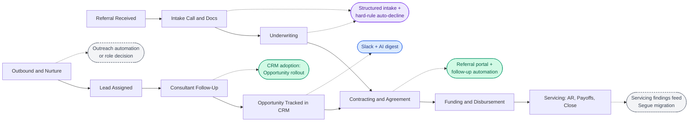
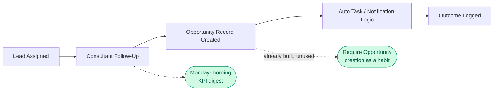
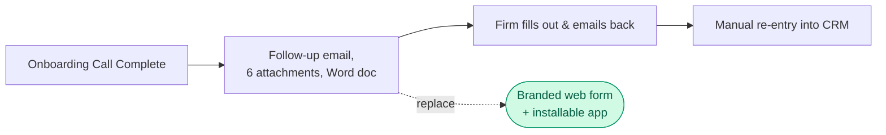
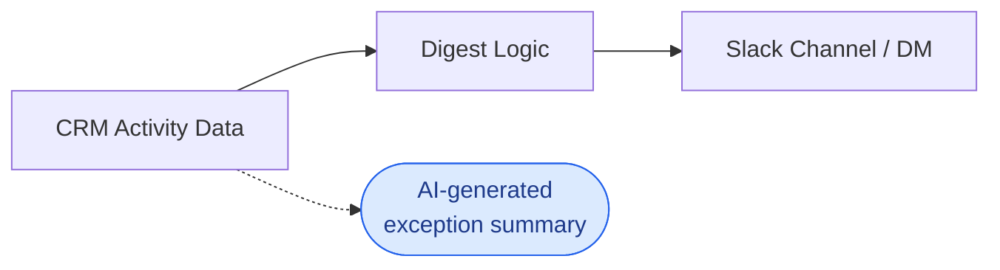
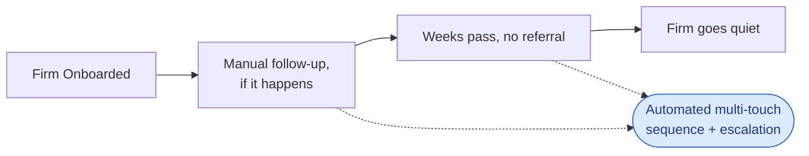
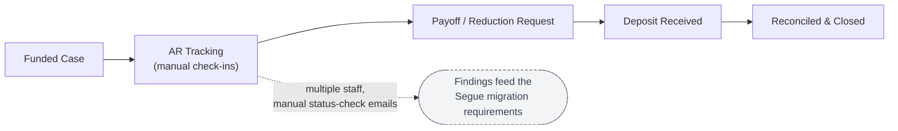
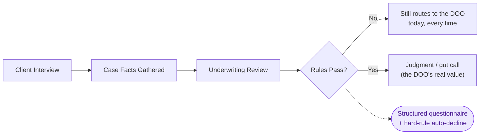

> **INTERNAL DRAFT — not client-ready.** This still has internal source citations (want numbers, workflow-map links, effort/impact judgment calls) that need to be scrubbed or softened before this goes anywhere near the leadership team. Treat this as the working version of Proposal deliverables **#3 (Opportunity Map)** and **#4 (Quick Wins)** — see [[20260806_proposal-capital-financing-ai-automation-mapping]]. The full current-state process detail lives in [[20260616-Workflow-Map-Capital-Financing-merged]] and stays the living reference; this document is the curated, prioritized, presentation-facing layer built on top of it.
>
> **Note on naming:** this version deliberately refers to roles and departments (CEO, DOO, Controller, Salesforce Administrator, Servicing/AR Lead) rather than individuals, so the map holds up regardless of who's actually in each seat.

# Capital Financing — AI & Automation Opportunity Map

## What this document is for

This is the answer to "where should we actually spend automation effort, and why." It's built from eight weeks of discovery — the full workflow map, the CEO's dictated wants, and direct 1:1s with the DOO, the Servicing/AR Lead, and the Salesforce Administrator. **The value here isn't new discovery** — it's turning eight weeks of scattered calls, dictations, and half-formed ideas into one scored, ranked framework that's consistently applied, so priority never has to be re-litigated from scratch every time a new idea comes up.

**How to use it going forward:** whenever a new idea comes in (from leadership, from a call, from anywhere), the first move is to check whether it already lives here. If it does, it gets folded into the existing opportunity rather than treated as something new. If it doesn't, it gets scored against the same framework below and slotted in — either onto the main map, or into the backlog appendix until it's scoped enough to promote. This is what keeps leadership's stream of new ideas from turning into scope creep: everything gets measured against the same yardstick, in one place.

**What this is not:** a build spec. Nothing below prescribes exact tools, screens, or technical architecture. The point is to identify *where* the highest-opportunity, highest-ROI areas are and *what kind* of solution would plausibly fit — a rules engine, an adoption push, a sync job, an AI-assisted layer — not to design it.

**What this doesn't cover yet:** this map is weighted toward intake, underwriting, and sales, because that's where discovery has gone deepest so far. The Servicing/AR Lead's Contracting/Funding/Payouts process is already well-SOP'd and largely represented through Opportunity #6 below, and the Controller's finance role isn't represented as its own opportunity at all yet. That's a gap in this pass, not a judgment that those areas don't matter — a dedicated look at controller- and contracting-specific automation is still owed once those 1:1s are fully synthesized.

---

## The Framework

Every opportunity is scored on two axes and sorted into one of four tiers.

**Effort** — Low / Medium / High. Rough build lift: Low = adoption/training or a small config change; Medium = a defined, scoped build (days, not weeks); High = a multi-phase build or one that depends on other unresolved pieces.

**Impact** — Low / Medium / High. Rough business value if it worked: revenue protected or unlocked, staff time freed up, or a load-bearing risk (single point of failure, compliance exposure) reduced.

| Tier | Meaning |
|---|---|
| 🟢 **Quick Win** | Low effort, ready or nearly ready to switch on now. |
| 🔵 **Near-Term** | Real build, but scoped and sequenced — next up once quick wins land. |
| 🟣 **Strategic** | High effort, high impact — multi-phase, needs real design work. |
| ⚪ **Needs Decision First** | Not yet buildable — blocked on a decision, missing information, or someone else's timeline (the Salesforce Administrator, the DOO's SOP content, an org/economics call). |

**One honest gap in this framework:** Effort and Impact are scored qualitatively (Low/Med/High), not in dollars or hours. That's deliberate — inventing precise figures we don't have would be less honest than a clear qualitative call, and none of the calls so far have produced reliable time/cost baselines. Getting real numbers (hours currently spent on manual servicing check-ins, cost per unfilled Opportunity record, etc.) is a concrete next step, not something this version pretends to already have.

---

## Foundational note: systems architecture is already decided

Two opportunities below (Servicing Automation and Intake/Underwriting Structuring) sit on top of a systems decision that's already been made, not something still open: **Salesforce stays the CRM and system of automation/reporting; Segue is being adopted only for the ops/finance staff who need its financial-software features (~6 people), with an integration bridging the two.** Separately, the current case-management system (Mighty/JB) is expected to migrate onto Segue over time — a decent portion of the manual servicing/AR work described in Opportunity #6 below is expected to be addressed directly by that migration, though not all of it. None of this is itself ranked as an opportunity — it's context that keeps the items below from looking more uncertain than they are.

### If you only do three things

The numbering below is for reference, not priority order — tier and impact carry the actual ranking. If nothing else moves forward, these three matter most: **#1 (sales adoption)** because it's paid-for and unused, **#2 (referral portal)** because it's already in motion, and **#12 (SharePoint information architecture)** because it's foundational, low-risk, and sets up a strong opening for further work.

---

## A. The Opportunity Map

### Overview

### Priority summary

| # | Opportunity | Tier | Effort | Impact | Likely Owner |
|---|---|---|---|---|---|
| 1 | Sales follow-up & pipeline adoption | 🟢 Quick Win | Low | High | Sales leadership + Salesforce Administrator |
| 2 | Referral/case-submission portal | 🟢 Quick Win | Low–Med | High | DOO's team |
| 3 | Slack + exception-based digest | 🔵 Near-Term | Med | High | Salesforce Administrator |
| 4 | Referral-gap detection & firm follow-up | 🔵 Near-Term | Med | High | Salesforce Administrator |
| 5 | Salesforce → MailChimp sync | 🔵 Near-Term | Low–Med | Medium | Salesforce Administrator |
| 6 | Post-funding servicing/AR/payoffs — input to the Segue migration | ⚪ Needs Decision | — | High | Ops leadership |
| 7 | Intake & underwriting structuring | 🟣 Strategic | Med–High | High | DOO |
| 8 | Executive inbox AI assistant | 🟣 Strategic | Med–High | High | CEO + Blue Tusk |
| 9 | Internal staff FAQ assistant | 🟣 Strategic | Medium | Med–High | DOO + Blue Tusk |
| 10 | Outbound outreach: automate-or-retire the role | ⚪ Needs Decision | — | Medium | CEO |
| 11 | Conference list automation & territory structure | ⚪ Needs Decision | High | Medium | CEO |
| 12 | SharePoint information architecture & adoption | 🟢 Quick Win | Low–Med | High | Blue Tusk (design) + DOO (rollout) |

---

### 1. Sales follow-up & pipeline adoption — 🟢 Quick Win

**The pain:** Consultants aren't consistently following up, and there's no visibility into who's working what. The fix for most of this **already exists** — a full Opportunity object with case-expense/pre-settlement-specific stages and automated task/notification logic (7-day no-meeting trigger, 30-day no-referral trigger) was already built in Salesforce, but it hasn't been adopted as a working habit yet, so it has no data to act on. Same story with the KPI dashboard: built, reviewed once, not yet rolled out day-to-day.

**The opportunity:** this is almost entirely an adoption problem, not a build problem. Make Opportunity creation a required, trained habit; turn the existing KPI dashboard back on; and deliver leadership a standing Monday-morning summary of each consultant's activity instead of requiring anyone to dig for it manually.

*Solution shape:* training + enforcement, not new development; a scheduled report/dashboard view once habits are in place.

---

### 2. Referral/case-submission portal — 🟢 Quick Win

**The pain:** Firms submit case documentation via a Word document leadership has called "unappealing, overwhelming, and unprofessional." This is the CEO's own stated #1 business-loss concern.

**The opportunity:** replace the Word doc with a branded, firm-specific web form (unique link per firm) with validation, document upload, and auto-notifications — already in motion as a low-risk build with the DOO's team.

*Solution shape:* a form tool (already chosen), eventually installable as a lightweight app so firm staff don't lose the link.

---

### 3. Slack + exception-based digest — 🔵 Near-Term

**The pain:** Leadership navigates roughly 100 Salesforce reports to find what matters, and largely doesn't — the clear preference is for information to be pushed proactively rather than sought out. The Slack subscription is already purchased; the AI-summarization layer on top isn't built yet.

**The opportunity:** an exception-based daily/weekly digest — who's gone inactive, what's stalled, what needs attention — delivered where the team already is. Sequenced after Opportunity #1 lands, since the digest needs real data to summarize.

*Solution shape:* a scheduled summarization layer reading CRM data, delivered via the Slack integration already in place.

---

### 4. Referral-gap detection & automated firm follow-up — 🔵 Near-Term

**The pain:** A firm gets onboarded, excited, and often never sends its first case — or sends one and goes quiet. No structured mechanism currently catches this.

**The opportunity:** a defined multi-touch sequence keyed off CRM timestamps (last referral, last call, last email) with automatic escalation if a firm goes cold, rather than relying on someone remembering to check in.

*Solution shape:* an extension of the same Opportunity/task automation pattern already built for #1 — timestamp-triggered tasks and templated touches, not a new architecture.

---

### 5. Salesforce → MailChimp sync — 🔵 Near-Term

**The pain:** Warm-audience marketing runs through MailChimp now, but getting a current contact segment (active/inactive/prospect) there is a fully manual monthly CSV export-and-upload.

**The opportunity:** automate the sync so it doesn't depend on someone remembering to run it, with segment tags preserved on the MailChimp side.

*Solution shape:* a scheduled export or direct API sync between the two systems — one-directional, no new segmentation logic needed.

---

### 6. Post-funding servicing/AR/payoffs — input to the Segue migration — ⚪ Needs Decision First

**The pain:** Multiple staff spend real time on manual, discretionary check-in emails to law firms on active cases, purely to track status toward settlement. Both the CEO and DOO have independently called this function ripe for automation.

**Context — this is a migration-scoping item, not a stand-alone build.** A decent portion of this is expected to be handled directly by the planned migration off the current case-management system (Mighty/JB) onto Segue — but not all of it. Rather than scoping this as new development, the weaknesses below are worth carrying explicitly into what the team asks for and evaluates during that migration, so they aren't lost in a generic "modernize the system" conversation.

**Documented weaknesses to carry into the Segue transition:**
- No automated reminders exist today — follow-up cadence is fully manual.
- Cadence is discretionary and undocumented — it varies by staff member and by firm relationship, with no written rule behind it.
- Multiple staff members currently do overlapping manual check-in work that a single cadence engine could consolidate.
- Reconciliation between the case-management system and the financial system today relies on a manual, name-based match rather than a shared case ID — worth confirming directly whether Segue solves this natively or whether the same manual match persists after migration.

*Solution shape:* not a stand-alone build — a set of requirements to bring into the Segue migration conversation. Revisit as a ranked, buildable opportunity once the migration's scope and timeline are clear, since whatever the migration doesn't cover is the actual remaining work.

---

### 7. Intake & underwriting structuring — 🟣 Strategic

**The pain:** Underwriting has two distinct layers — a rules-based layer (state law, case type, eligibility) and a judgment layer (attorney/firm reputation, gut read) — but today, every case reaches the DOO for review regardless of which layer it actually needs. This is also the single biggest blocker to the Segue build, which needs the intake questionnaire structured before it can be customized.

**The opportunity:** structure the rules-based layer as a defined questionnaire with hard-rule checkpoints, so a case that clearly fails never needs to reach the DOO at all — freeing that role's time for the judgment calls only it can make.

*Solution shape:* a decision-tree-style intake questionnaire (client and law-firm facing) feeding a rules engine, not a full underwriting-AI build — the judgment layer stays human by design. **Gated on the underlying intake/underwriting content being written down** — see the backlog note below.

---

### 8. Executive inbox AI assistant — 🟣 Strategic

**The pain:** The CEO personally fields 200–300 emails/day, a meaningful share of which shouldn't land there at all (staff/HR questions that should go to the DOO, case intake that should go to the team) or are low-value overhead (redundant status reports, repeated approval loops).

**The opportunity:** already fully specified by the CEO directly — a suggest-don't-auto-forward triage layer, draft-shortening help, and aging-email flags, working inside the existing inbox with no folders or rules (an explicit hard constraint).

*Solution shape:* an in-line, suggestion-based assistant layered on Outlook — not an auto-sort/auto-file system, which has been explicitly ruled out.

---

### 9. Internal staff FAQ assistant — 🟣 Strategic

**The pain:** Standard staff questions (PTO process, intake procedure) route to the DOO or CEO directly, or get lost in a disorganized SharePoint. Both have independently proposed roughly the same idea.

**The opportunity:** a retrieval-based Q&A layer over the company's actual documentation, with SharePoint remaining the source-of-truth library underneath it.

*Solution shape:* straightforward once the underlying content exists — **this is gated on the DOO's SOPs/FAQ material actually being written**, not a technical blocker.

---

### 10. Outbound outreach: automate-or-retire — ⚪ Needs Decision First

**The pain:** Current cold outreach produces effectively zero substantive replies at real volume (documented: 160 sends in a day, zero real responses), and the staffing cost isn't clearly justified.

**The opportunity:** either automate the cadence properly or retire the function — but this needs a people/role decision from leadership before it's a build question.

*Solution shape:* not scoped until the role decision is made.

---

### 11. Conference list automation & territory structure — ⚪ Needs Decision First

**The pain:** Matching new conference contacts against ~25,000 existing Salesforce contacts is a manual, ~2-hour-per-list task with only ~50% auto-match; assignment to consultants is also manual and untracked.

**The opportunity:** automate matching and assignment — but assignment logic depends on defining consultant territories first, which is an organizational/economics decision, not a technical one.

*Solution shape:* not scoped until the territory question is resolved.

---

### 12. SharePoint information architecture & adoption — 🟢 Quick Win

**The pain:** Company-wide file organization is genuinely poor — not a preference issue between tools, but a real gap independently flagged by multiple people on the leadership team. Sensitive documents (bank reporting) reach the CEO only via one-off email attachments, with no shared access at all. Different parts of the team default to different systems out of habit, and even where SharePoint is already in use, there's no consistent folder structure or naming convention, which makes it hard to trust or navigate.

**The opportunity:** this is **decided, not open** — SharePoint is the company-wide system going forward. What's still needed is the actual information architecture: a defined folder taxonomy, naming conventions, and governance rules, plus a real migration and change-management push to get everyone onto one consistent structure. This is deliberately scoped as foundational, not a full automation build — but it's the base every future document-facing automation depends on, including a staff-facing FAQ assistant (Opportunity #9) or any future direct connection between Claude and the company's documents for search, summarization, or drafting. That connector work is a natural next phase once the taxonomy exists — not something to build before the foundation is in place.

*Solution shape:* an information-architecture and change-management project — taxonomy design, migration, and adoption habits — not a software build. Simple and contained relative to everything else on this map, which is exactly why it's well-suited to be a fast, visible win.

---

## B. Quick Wins (ready to move on now)

Per the proposal, quick wins are a possibility surfaced by discovery, not a promise — these three are the ones that actually clear that bar:

1. **Sales follow-up & pipeline adoption (Opportunity #1 above).** Zero new build — this is turning on and enforcing use of automation that's already been paid for and built. Highest-leverage single move available on this entire map.
2. **Referral/case-submission portal (Opportunity #2 above).** Already scoped and in motion with the DOO's team on a low-risk, low-cost tool. Needs a check-in to confirm it's actually moving, not a new decision.
3. **SharePoint information architecture & adoption (Opportunity #12 above).** No build required — taxonomy design plus a real rollout push. Worth calling out specifically as a strong, low-risk opener for a follow-on engagement: contained, visible, and it's the foundation several other opportunities on this map (and future ones) will eventually depend on.

Everything else on the map is a real build or a pending decision — sequencing them is the next conversation, not something to promise before it's scoped.

---

## C. How new ideas get added

1. **Check if it's already here.** Most new ideas map onto one of the twelve opportunities above, sometimes as a new detail on an existing one rather than something new.
2. **If it's genuinely new,** score it: Effort (Low/Med/High), Impact (Low/Med/High), using the same definitions as the framework above.
3. **Tier it** using the same logic — Quick Win, Near-Term, Strategic, or Needs Decision First.
4. **Slot it into the backlog appendix below** with its source and date. It only gets promoted onto the main map once it's scoped enough to sit next to the other twelve — a one-line idea doesn't jump straight to the priority table.

This is the mechanism for keeping leadership's stream of new ideas from becoming scope creep: everything gets measured the same way, in one place, instead of each new idea getting its own ad hoc conversation about whether it matters.

---

## Appendix: Full Backlog

Everything tracked that isn't on the curated map above — either too early-stage to score confidently, or minor enough not to warrant a headline slot. Full detail lives in [[xx_howies_wants]].

| Item | Tier | Note |
|---|---|---|
| AI-readable LinkedIn/Facebook bio | 🟢 Quick Win (minor) | Zero-build, low-impact housekeeping — a prompt leadership runs directly. |
| Move training videos off Vimeo | 🟢 Quick Win (minor) | File migration/reorg, no technical build. |
| Team-wide AI notetaker | 🟢 Quick Win (minor) | Tool selection + rollout; adoption is the real work, not the tool. |
| Outreach contractor repositioned as personal assistant | ⚪ Needs Decision | Depends on the outreach automate-or-retire call (Opportunity #10) landing first. |
| KPI dashboard improve-vs-leave-as-is call | ⚪ Needs Decision | Requires a direct review with the Salesforce Administrator before recommending either way. |
| Consultant dashboard / weekly reporting layer | 🔵 Near-Term | Downstream of Opportunity #4 (referral-gap detection) — sequence after, not before. |
| Territory-based FC structure | ⚪ Needs Decision | Org/economics decision; blocks Opportunity #11. |
| Commissions-spreadsheet automation | 🔵 Near-Term | Overlaps with Opportunity #1 — scope together once CRM adoption is underway. |
| Segue/Salesforce hybrid architecture | — | Already decided; see Foundational Note above. Not a ranked opportunity. |
| State/regulatory registration renewal tracker | 🟢 Quick Win (minor) | Small, contained tracking need (litigation-funding state registrations, annual renewals) — currently an ad hoc spreadsheet just started. Low effort, modest impact; not headline material but genuinely useful. |

---

*Source material: [[20260616-Workflow-Map-Capital-Financing-merged]] (current-state process detail), [[xx_howies_wants]] (full ranked want list with sourcing), [[xx_Project_Learnings]] (relational/behavioral context). Built from discovery through 2026-09-XX.*
