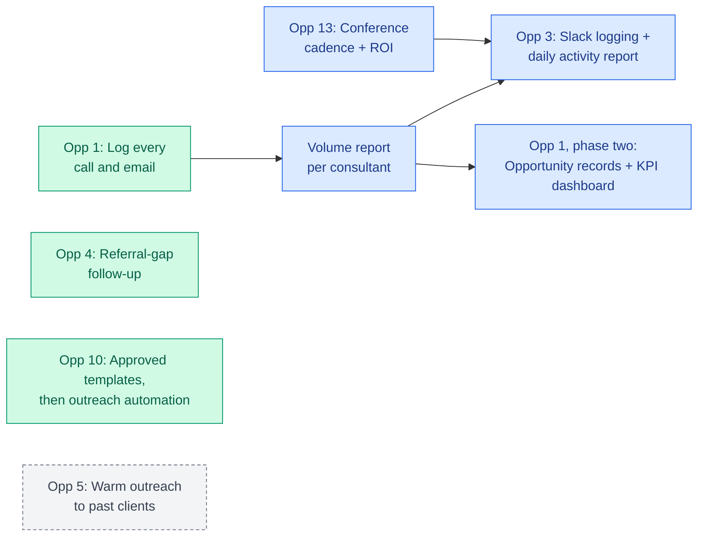

# Capital Financing: The Plan

45 minutes of presentation, then 15 minutes for questions. The full Opportunity Map has the detail behind every item here. This version is for deciding and moving.

| Time | Section |
|---|---|
| 0:00 | 1. The answer |
| 0:04 | 2. What's already moving |
| 0:10 | 3. The sales push |
| 0:24 | 4. The next 90 days |
| 0:31 | 5. Who does what |
| 0:36 | 6. What execution takes |
| 0:42 | 7. Decisions for today |
| 0:45 | Questions |

---

## 1. The answer (4 min)

**There's a plan.** Fifteen opportunities, each scored on effort and impact, ranked in one map. When a new idea comes up, it gets checked against this map and scored the same way.

**Sales comes first.** Growth isn't capped by how many leads come in. It's capped by what happens after a lead lands. Six of the fifteen opportunities sit on that pipeline, and they lead.

**The first step is small, and it has already started.** Every consultant logs every call and email in Salesforce. Everything else on the sales side reads from that data.

**Most of what's needed is already paid for.** Salesforce already has an Opportunity pipeline and automated follow-up tasks, built and unused. Slack is bought. Planner and SharePoint come with the Microsoft tools you already have. A lot of this map is turning on what you own.

---

## 2. What's already moving (6 min)

| Work | Owner | Where it stands |
|---|---|---|
| Call and email logging (Opp 1) | Sales leadership + Salesforce Administrator | Rolling out now. Three bookmarked Salesforce views and a one-page training doc. |
| Segue migration scoping (Opp 6) | DOO | In progress. Scoping fields directly with Segue and building it for your volume instead of rushing it. |
| Intake and underwriting SOPs (Opp 7) | DOO | In progress. These SOPs become the decision tree Segue automates. |
| Contracting, funding, and AR process | Servicing/AR Lead | Documented. Feeds the same Segue requirements. |
| Conference attendee reporting (Opp 13) | Salesforce Administrator | In progress. The foundation for conference ROI. |
| Referral portal (Opp 2) | DOO's team | Scoped and in motion. Needs a quick status check. |

**Opportunities 6 and 7 are one effort.** The SOP work happening now and the Segue scoping both feed a single set of requirements. Once Segue is live, that structure is what gets automated. Segue also reportedly has a potential API integration, which would open up more automation on top of your servicing data later.

---

## 3. The sales push (14 min)

The six starred opportunities, in the order they build on each other.

### Step 1. Log everything (Opportunity 1). Now.

Every call and email gets logged as it happens, for every contact. Once that habit holds, a simple report shows call and email volume per consultant per day, with leadership's own volume as the benchmark. Opportunity records and the KPI dashboard come after that, once there's real data behind them.

The KPIs are already defined in the CEO's own FC training: referred revenue against goal, volume of advances referred, new law firm accounts, Strategy Calls, Case Expense Onboarding Calls, and time to first funding.

### Step 2. Make logging easy and visible (Opportunity 3). Once logging holds.

A consultant logs a call from Slack in a click or two. An automated report of calls, emails, and KPIs goes to each consultant as well as to leadership, so consultants see their own numbers every day. This starts after a few weeks of real logging data.

### Buildable now, alongside Step 1

**Referral-gap follow-up (Opportunity 4).** A firm signs on, then goes quiet. An automated sequence catches it and escalates, built on the follow-up tasks Salesforce already has.

**Outreach automation (Opportunity 10).** Start with one approved email template per motion, stored in SharePoint. AI drafts from the template, so consultants stop writing from a blank page. Full sequencing across all six email motions follows.

### In motion

**Conference follow-up and ROI (Opportunity 13).** Pre-conference, during, and post-conference touches, built on the attendee reporting already in progress. For the first time, a referral traces back to the conference that produced it. This also feeds the Opportunity 3 daily report.

### Waits on the incoming CMO

**Warm outreach to past clients (Opportunity 5).** Salesforce becomes the live source for these lists instead of a monthly manual export. Which tool sends them is the CMO's call.

### What decides whether this works

Consistent logging. Every item above reads from that data. If consultants don't log, nothing downstream has anything to work with.

---

## 4. The next 90 days (7 min)

A proposed sequence. Dates firm up once owners confirm.

**This plan runs through your busy season.** The DOO and the Controller have both said the workload stays heavy until February or March, and people are already pulled in several directions. Moving this forward during that stretch takes good coordination and a clear, agreed order of priorities, so nobody is asked to push on everything at once.

### Days 1 to 30

- Logging habit takes hold. Volume report goes live. (Opp 1)
- Planner set up with this map loaded and one owner per item. (Opp 15)
- SharePoint folder structure and naming conventions designed. (Opp 12)
- Approved email templates drafted. (Opp 10)
- Conference lists cleaned up by Claude before upload. (Opp 11)
- Referral portal status confirmed. (Opp 2)

### Days 31 to 60

- Referral-gap follow-up sequence built. (Opp 4)
- Conference touch sequence built on the attendee reporting. (Opp 13)
- SharePoint migration push. (Opp 12)
- First month of volume data reviewed, and a start date set for Opp 3.

### Days 61 to 90

- Slack logging and daily activity report, if logging has held. (Opp 3)
- Opportunity records and the KPI dashboard switched on. (Opp 1, phase two)
- Once the CMO is in place: warm outreach lists and SEO performance visibility handed over. (Opp 5, Opp 14)

**Running alongside the whole time:** Segue scoping and the intake and underwriting SOPs, owned by the DOO. (Opp 6, Opp 7)

**Later, once the foundations exist:** the executive inbox assistant (Opp 8) and a staff FAQ assistant in Claude (Opp 9).

---

## 5. Who does what (5 min)

| Role | Your part in the next 30 days |
|---|---|
| CEO | Set logging as a standing requirement for every consultant. Review the volume report weekly. |
| DOO | Keep going on Segue scoping and the SOPs. Confirm referral portal status. |
| Servicing/AR Lead | Check the Segue requirements against the documented contracting, funding, and AR process. Flag anything Segue can't handle. |
| Controller | No new asks yet. A finance opportunity gets added once those conversations are scoped. |
| Salesforce Administrator | Build the volume report once logging starts. Keep building attendee reporting. |
| Financial Consultants | Log every call and email as it happens. That's the whole ask for now. |
| **Not yet owned** | Planner setup. SharePoint structure design. Email templates. Conference list cleanup. Building the Opp 4 and Opp 13 sequences. Keeping this map current. |

---

## 6. What execution takes (6 min)

The map answers what to do. The open question is who does it.

**The work outweighs current capacity.** The Salesforce Administrator is the likely owner on seven of the fifteen opportunities. The DOO is on six, on top of running operations and writing SOPs.

**Several items have no owner.** See the last row of the table above.

**Someone has to hold the plan.** New ideas will keep coming. Without one person scoring them against this map and deciding what gets built next, priority gets re-argued every week and the map goes stale.

**Automations need upkeep.** Every build needs someone who understands it when it breaks or when the process changes.

### The hire question

This engagement was set up to answer whether Capital Financing needs dedicated AI and automation help. **The answer is yes.** There's enough build work on this map to keep a dedicated builder busy. A builder on their own starts with none of the business context behind this map, so the role works best paired with someone who holds that context and decides what gets built next.

| Option | What it looks like | Trade-off |
|---|---|---|
| Run it in-house | The team takes on every item alongside current roles. | Lowest cost on paper. Capacity is the limit, per above. |
| Per-project vendors | A different vendor for each build. | Each one starts from zero context, and someone has to coordinate them all. |
| **Dedicated builder with direction** (recommended) | One builder executes. One person holds the context and sets priorities. | Continuity, and new ideas get acted on right away. |

Structure and cost get covered with the CEO directly.

---

## 7. Decisions for today (3 min)

1. **Logging becomes a standing expectation**, set by the CEO, starting this week.
2. **Sales goes first.** Confirm the six starred opportunities lead.
3. **Name who owns the map day to day** and who sets up Planner.
4. **Set a time** for the CEO and Blue Tusk to settle how execution gets staffed.

---

## Questions (15 min)

The full Opportunity Map has the detail on all fifteen opportunities, the scoring framework, the Financial Consultant workflow shell, and the full backlog.
