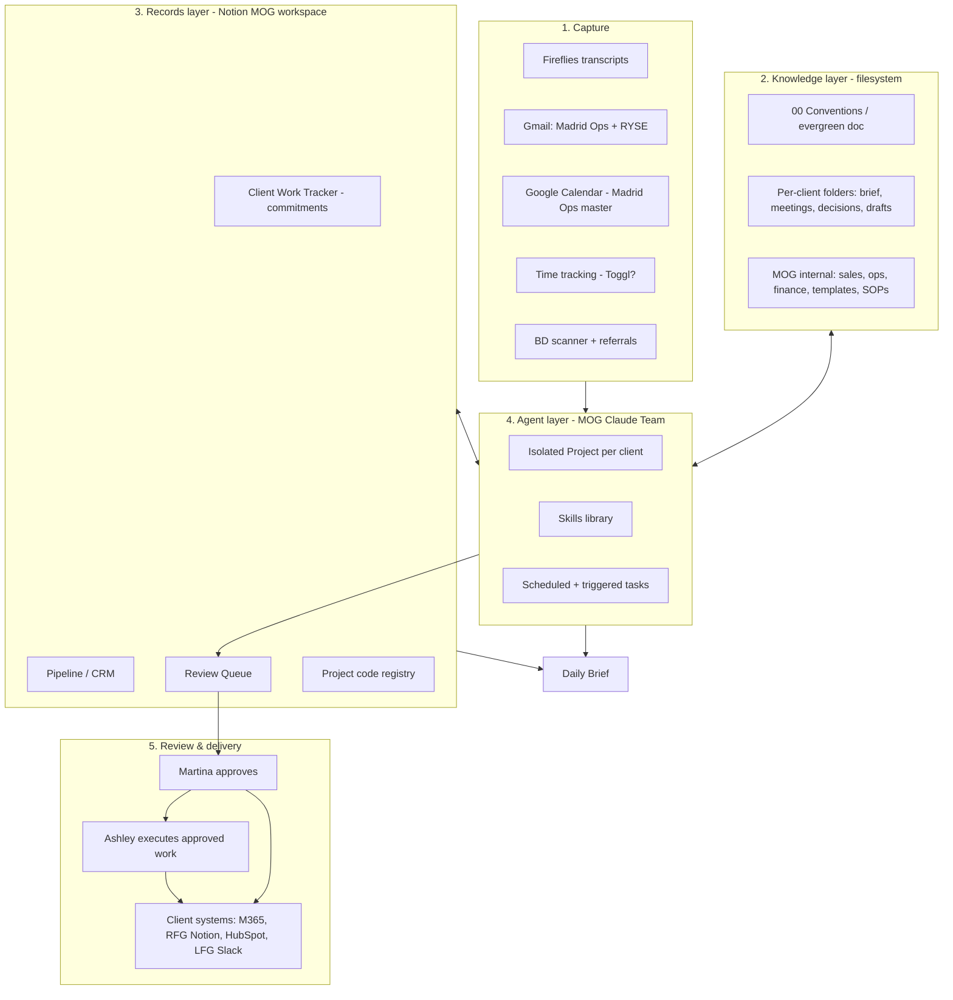

# AI-Native Stack Architecture: Madrid Operations Group

**Draft v0.1. Internal, not client-facing.**

## Summary
This is the first draft of the target architecture for MOG's AI-first rebuild. It sets out five layers:
1. **Capture**
2. **Knowledge** (a filesystem built around per-client folders)
3. **Records** (structured Notion databases)
4. **Agents** (the MOG Claude Team account, built to be AI-agnostic)
5. **Review & Delivery** (one draft-and-confirm queue that enforces Martina's human gates)

The most important early call is Google vs SharePoint, and that is still open. Much of this is direction rather than final design. The open decisions are listed explicitly near the end.

## Context
**Sources:**
- JC's long notes and comments in [[SOPs/20261007_MOG_First_Steps_Discovery]] (comments [a], [b], [p], [q], [t], [u], [w]).
- [[20261007_MOG_Current_State_Workflow_Map]].
- The 2026-10-07 call decisions, recorded in [[20260929_Madrid_Operations_Group_Client_Brief]].
- Blue Tusk product thinking:
  - [[business/projects/internal/product/20260814_information-taxonomy-offering-stack]]
  - [[business/projects/internal/product/20260816_ai-file-integration-capability-reality-check]]

**Why the product notes matter here.** MOG is a live, small-scale pilot of the Blue Tusk offering stack:
- **Layer 1 (taxonomy):** MOG's folder structure and project codes.
- **Layer 1.5 (skills + navigation files):** the evergreen doc and isolated Projects per client.
- **Layer 3 (draft-and-confirm working partner):** the review queue.
- **Flagship use case (meeting transcripts):** the AI chief of staff.

What we learn here should feed back into those notes. This is the reduced-price R&D value the SOW refers to.

---

## 1. Design principles

1. **Make the information legible before automating it.** Agents are only as good as the structure they read. The folder taxonomy, project codes and evergreen doc come first; the automations come after. Bad structure produces confidently wrong drafts and wasted tokens (taxonomy note, problem statement).
2. **Draft-and-confirm everywhere.** AI and Ashley prepare; Martina approves. This is how Martina wants to work (her non-negotiables). It also matches what the platforms can reliably do today (reality-check note). One review pattern covers every workflow, which keeps it learnable.
3. **AI-agnostic by construction.** Context lives in portable, human-readable files (client briefs, the conventions doc and skills as plain documents), and connections use open standards (MCP connectors). If MOG switched AI vendors tomorrow, the knowledge layer and records layer would carry over unchanged, and only the agent layer would need rewiring.
4. **Client isolation by structure.** Each client gets its own folder, its own project code and its own isolated AI Project. No agent task reads across clients. This satisfies Martina's confidentiality gate without scattering MOG's knowledge.
5. **Draft in MOG, deliver to the client.** MOG's system is where Claude has full context. Finished work is pushed into each client's own system. Martina's tools can't follow her into every client engagement, but her context can stay in one place.
6. **Built for multiple users from day one.** Martina, Ashley and Alexis are users now, and it should be easy to add an operator. Roles determine what each person and each agent can see and do.
7. **Every tool maps to a workflow.** A tool that doesn't serve a mapped workflow gets cancelled (P-003).
8. **Project codes are the shared key.** One code per engagement (MC, RFG, LFG-COO, LFG-LA, RYSE, AEQ, plus MOG-ADM and MOG-BD) runs through folders, tracker rows, file names, calendar events, hours and email labels. This is what lets the daily brief join data from different sources.

---

## 2. Architecture overview



---

## 3. The layers

### Layer 1: Capture
Where raw inputs enter the system. Nothing is processed here; inputs are only collected and tagged with a project code wherever possible.

| Source | What it captures | Feeds | Notes |
|---|---|---|---|
| Fireflies | Call transcripts | W1 close out, commitments, prep | Keep for now (see D4). A bot-free option exists. |
| Gmail (Madrid Ops, RYSE) | Client and prospect email | Inbox categorization, "what needs me," prep context | RYSE inbox is client-owned. Confirm what access is allowed. |
| Google Calendar (Madrid Ops master) | Calls, work blocks, deep work days | Daily brief, prep schedule, hours fallback | The master calendar is moving from RYSE now. Prerequisite for the daily brief. |
| Time tracking | Hours by project code | Cap check, invoicing (W2) | Toggl trial (D5). Until then, the calendar's all-day tallies. |
| BD scanner, referrals, BDR.ai replies | Leads | CRM | BDR.ai itself is out of scope; only its leads flow in. |
| LFG Slack | Client messages | "What needs me" | Client-owned. Read only. |

### Layer 2: Knowledge (filesystem)
This is the core of the design and the Layer 1 taxonomy work applied to MOG. It holds documents and context: anything an agent needs to read to understand a client or a process.

**Proposed folder taxonomy (draft to react to, not final):**
```
MOG/
├── 00_Conventions/            ← evergreen doc: how MOG works, project codes, naming, where things live
├── 01_Clients/
│   ├── MC_Maycomb-Capital/
│   │   ├── 00_client-brief           ← living context: people, scope, cap, tools, AI policy, open items
│   │   ├── 01_meetings/              ← close-out notes, by date
│   │   ├── 02_decisions/             ← decision log
│   │   ├── 03_drafts/                ← AI and Martina drafts before delivery to client
│   │   ├── 04_delivered/             ← copies or links of what went to the client
│   │   └── 05_reference/             ← templates and examples specific to this client
│   ├── RFG_Ruthless-for-Good/
│   ├── LFG_LendForGood/              ← one folder, two codes (LFG-COO, LFG-LA)
│   ├── RYSE_RYSE-Creative/
│   └── AEQ_Aequilibria/
├── 02_Sales/                  ← prospects, proposals, SOW/MSA templates, case studies
├── 03_Operations/             ← SOPs, Ashley's hub material, team roles
├── 04_Finance/                ← invoice drafts, hours exports (no bank credentials, ever)
├── 05_Marketing/              ← LinkedIn drafts, website copy
└── 06_Events/                 ← convening and event service line (Alexis)
```

**Rules for the knowledge layer:**
- **What stays out of MOG's context folders:** client financials, client customers' data, personnel matters and anything under a client-specific AI restriction. This was agreed on the call. Example: LFG's rule of no lender or borrower financial data in AI.
- **The client brief is the anchor.** Every agent task for a client starts by reading that client's brief, the same pattern as Blue Tusk's own briefs. It is also what keeps the system AI-agnostic, since any AI can read a brief.
- **Close outs and decisions get appended, never scattered.** This fixes "next steps in four places."
- **Format:** see D2. Plain text or markdown is the most AI-agnostic and the cheapest in tokens; Google Docs or Word is easier for Martina and Ashley to edit.

**Platform: Google Drive or SharePoint.** This is open; see D1.

### Layer 3: Records (Notion MOG workspace)
Structured data that has states, owners and dates belongs in databases, not documents. Notion stays: Martina already pays for it, Ashley's hub lives there, Martina likes it, and Notion AI can build the CRM quickly.

| Database | Purpose | Status |
|---|---|---|
| Project code registry | One row per engagement: code, client, cap, period, billing rule (e.g. MC overage billable), tools, AI policy | New. Small, but everything else references it. |
| Client Work Tracker | Commitments and next steps, by code, owner and due date | Exists. Restructure around codes and AI-generated commitments. |
| Pipeline / CRM | Contacts, deals, last touch, follow-up date | Exists in name only. Quick win (P-007). Needs the contact export. |
| Review Queue | Every AI draft awaiting Martina: type, code, link, due-by, status | New. The single human-gate inbox (see Layer 5). |
| Executive Assistant Hub | Ashley's SOPs, Delegation Board, The Handoff | Exists. Keep, and update as Ashley's role changes. |
| LinkedIn content DB, BD Scanner Queue | Content pipeline; incoming leads | Exist. Keep. The scanner feeds the CRM. |

**Notion caveat:** the pain of switching the connector between the MOG and RFG workspaces stays as long as RFG work happens in RFG's Notion. That's expected, since RFG's workspace is client-owned. The fix is to do RFG drafting in MOG's RFG folder and push the finished work to RFG's Notion. That cuts down on switching but doesn't remove it entirely.

### Layer 4: Agents (MOG Claude Team account, AI-agnostic)
- **Isolated Project per client.** Each client Project loads the MOG evergreen doc plus that client's brief and folder path. This is the Layer 1.5 pattern from the taxonomy note. It saves tokens (agents don't search the whole drive) and enforces client isolation. Ashley and Alexis can create a new Project from a template when a client is onboarded (W4).
- **Skills library.** Migrate Martina's existing skills into the Team account:
  - RFG agenda and recap
  - LFG standups
  - Maycomb notes
  - LFG SOPs and loan trackers
  - Hours tracker
  - LinkedIn posts
  - HubSpot task updater

  Then add new ones: close out to commitments, prep packet, client check-in draft, invoice draft, proposal/SOW from the conversation history. Skills are written as plain documents, which keeps them portable.
- **Scheduled tasks:**
  - Daily brief, every morning, shorter on deep work days.
  - Close out for recurring meetings.
  - Prep packets the day before each call.
  - CRM follow-up reminders.
  - Weekly hours roll-up.
- **Triggered tasks:** close out for one-off meetings, onboarding setup, invoice draft at month end.
- **Inbox categorization.** JC's comment [a] suggests running this outside the Team plan, through the API with a small model, to save plan tokens and scale to more people. To be decided (D7).
- **AI-agnostic guardrails:** all context lives in Layers 2 and 3, not in chat history or platform memory. Prompts and skills are stored as files. No logic exists only inside a vendor-specific feature unless it has a documented equivalent. A local model was floated on the call as a long-term option if scheduled runs grow, and it isn't in scope now.

### Layer 5: Review & delivery
**One pattern for every workflow:** draft → Review Queue → Martina approves or edits → the approved item is executed. This is draft-and-confirm made concrete.

| Gate (Martina's non-negotiables) | Who drafts | Who approves | Who executes after approval |
|---|---|---|---|
| Client, prospect and partner communication | Agent / Ashley | Martina | Martina sends (her rule: "sends are mine") |
| Invoices, pricing, scope changes, payments | Agent / Ashley | Martina | Martina or Ashley sends invoices, per Martina's preference `[TO CONFIRM]` |
| Calendar conflicts | Agent / Ashley flags | Martina | Ashley |
| LinkedIn, website, marketing | Agent | Martina | Ashley may publish after review (JC's comment [b]) |
| Transcript facts going into client records | Agent | Martina, checked against the full transcript | Agent files it |
| Sensitive topics (personnel, legal, client finances) | Not drafted by agents | Martina only | Martina |

**Delivery into client systems** is a manual or semi-manual step at first: copy into the client's M365 or Google environment, RFG's Notion, HubSpot or LFG Slack. This is acceptable. Automating delivery into client-owned systems requires each client's permission and their own connectors, so it's out of scope for v1.

**Client Claude accounts.** Martina can't have two Claude accounts open at once. Using a separate browser profile for each client account (and keeping the MOG Team account in the desktop app) should solve this without a second computer. `[TO CONFIRM with Martina]`

---

## 4. Workflow-to-stack mapping

| Workflow | Capture | Knowledge | Records | Agent | 🔒 Gate |
|---|---|---|---|---|---|
| W1 Meeting lifecycle | Fireflies, Calendar | Client brief, meetings, decisions | Client Work Tracker | Prep packet (scheduled), close out (scheduled or triggered), commitments extraction | Transcript facts; check-ins before sending |
| W2 Time & invoicing | Toggl or Calendar | 04_Finance | Project code registry (caps, billing rules) | Weekly roll-up, cap flags, invoice drafts | Every invoice |
| W3 BD & sales | Scanner, referrals | 02_Sales templates, client history | CRM | Follow-up reminders, buildout-filter first pass, proposal/SOW drafts | Pricing, every send |
| W4 Onboarding | Signed SOW | New client folder from template | New registry row | Setup checklist, new Project from template | Communication norms set by Martina |
| W5 Inbox & calendar | Gmail, Calendar | Conventions (categories = project codes) | Review Queue for "needs Martina" | Inbox categorization | Calendar conflicts |
| W6 LinkedIn | Pillar topics | 05_Marketing | LinkedIn DB | Draft posts | Publishing |
| W7 Delegation to Ashley | n/a | 03_Operations SOPs | EA Hub | Every new build ships with an SOP | n/a |
| W8 Events (Alexis) | Event client calls | 06_Events | Registry row per event project | Same W1 pattern | Same gates |
| **Daily brief** | Calendar, Gmail, Slack | n/a | Tracker, CRM, registry, Review Queue | Scheduled morning task | n/a (read-only output) |

---

## 5. Tool decisions (current state → target)

| Tool | Decision | Reason |
|---|---|---|
| Claude Team (MOG) | **Keep: build home** | Decided on the call |
| Notion (MOG workspace) | **Keep: records layer** | Already paid; Ashley's hub; fast CRM build |
| Google Workspace | **Keep pending D1** | Martina's preference and JC's |
| Fireflies | **Keep, evaluate (D4)** | Works; bot-free option; "whatever serves the system" |
| QuickBooks Online, Wise, Chase | **Keep** | Bookkeeping isn't being rebuilt. The Wise-to-QBO matching is a later automation or an accounting-service question (P-009). |
| Toggl | **Evaluate (D5)** | Suggested on the call; free tier |
| BDR.ai, Selling.com | **Out of scope** | Marketing/outreach is a separate scope. Only their leads feed the CRM. |
| Canva | **Out of scope** | Branded materials are excluded in the SOW |
| Client-owned tools (HubSpot, LFG Slack, RFG Notion, Affinity, Asana, client M365) | **Delivery targets only** | Not MOG's to change |
| Other AI subscriptions | **Audit** | Cancel anything that doesn't map to a workflow. Costs needed (open question in the brief). |

---

## 6. Capability check: the August note is partly out of date

[[business/projects/internal/product/20260816_ai-file-integration-capability-reality-check]] concluded that Google Drive was "create-new only, no in-place editing," and that files land as Office formats rather than native Google files. What we've seen in this project since then:
- **Native Google Docs can be created.** On 2026-09-29 the Drive connector created Martina's First Steps doc as a native Google Doc (HTML converted by Drive), not a .docx.
- **Google editor connectors exist.** The google-workspace skill in Claude's environment documents Google Docs, Sheets and Slides editor connectors that read and edit files in place, including a suggestion mode. This **wasn't enabled in JC's chat, so it hasn't been tested.** The same skill also lists limits: reading comments has been unreliable, and suggestion mode can be refused.
- **Drive search is available.** JC's connector exposed search, read-content and create, which the August note said were missing.

**What this means:**
- The gap between Google and SharePoint may be narrower than JC's working assumption.
- JC's planned Google test should include the editor connectors.
- The August note should be updated after the test.
- Draft-and-confirm remains the design either way, because Martina's gates require it, whatever the platform can do.

---

## 7. Open decisions

| # | Decision | Options | Leaning | Needed by |
|---|---|---|---|---|
| D1 | Filesystem platform | Google Drive vs SharePoint | Google if JC's test passes (both prefer it; see Section 6). SharePoint as fallback. | Before Phase 0 folder build |
| D2 | Knowledge file format | Google Docs/Word vs markdown/plain text vs mixed | Mixed: briefs and conventions in an easy-edit format for Martina and Ashley; agent-generated logs in the most portable format the platform handles well | Phase 0 |
| D3 | Where the Review Queue lives | Notion database vs a Drafts folder with a status field | Notion (has states, owners and dates; Ashley already works there) | Phase 1 |
| D4 | Meeting notes tool | Fireflies vs Notion meeting notes vs other | Keep Fireflies unless it limits the close-out build | Phase 2 |
| D5 | Time tracking | Toggl (auto or manual) vs calendar tallies plus Claude | Toggl trial | Phase 1 |
| D6 | Client Claude accounts | Browser profiles vs second machine vs keeping work in MOG's account | Browser profiles | Now (cheap to try) |
| D7 | Inbox categorization runtime | Team plan scheduled task vs API with a small model | API, if volume justifies it | Phase 3 |
| D8 | Local model hosting | Not now | Revisit if scheduled-run costs grow | Post-retainer |

---

## 8. Build phases (fit to the retainer term, Sep 29 – Dec 29)

| Phase | Weeks | What | Depends on |
|---|---|---|---|
| 0. Foundations | 2–4 (Oct) | D1 decision, folder taxonomy, evergreen conventions doc, project code registry, a client brief for each code, Claude Team set up with isolated Projects, skills migrated | Google test; Martina's sign-off on the taxonomy |
| 1. Quick wins | 2–4 (in parallel) | CRM with follow-up cadence, v1 daily brief (scheduled task), Toggl trial, Review Queue | Contact export; Madrid Ops calendar as master |
| 2. AI chief of staff | 4–8 | W1 end to end: prep packets, close outs, commitments into the tracker, check-in drafts | Phase 0 (briefs, codes); D4 |
| 3. Hours → invoices | 6–9 | Weekly roll-up, cap flags, invoice drafts; inbox categorization | Toggl decision; billing rules in the registry |
| 4. Team enablement | 8–12 | SOPs for each new process, Ashley's redefined role and KPIs, Alexis onboarded, template for adding an operator | Phases 2–3 running |
| 5. Events service line | As engagements land | W8 mapped onto the same pattern | First event engagement (October) |

> Pacing note: the SOW lets Blue Tusk deprioritize this work behind higher-paying clients. Phases 0–1 are the ones to protect, because they give Martina visible relief and everything else builds on them.

---

## 9. Feedback into the Blue Tusk offering stack
Things to watch here and carry back to the product notes:
- How long the taxonomy design (Phase 0) actually takes for a small firm. This informs Layer 1 pricing.
- Whether isolated Projects per client measurably cut token use and errors. This validates the Layer 1.5 claim.
- How smooth draft-and-confirm is in practice for a non-technical principal and an EA. This is the core Layer 3 question.
- The Google editor-connector test results, for an updated reality-check note.

## Next steps
- [ ] Run the Google test (connectors, editor tools, Shared Drive behavior) and decide D1.
- [ ] Turn Phases 0–1 into the build plan for Martina, due Monday, Oct 12. Include the logins and data exports needed.
- [ ] Draft the evergreen conventions doc and project code registry.
- [ ] Ask Martina to try separate browser profiles for client Claude accounts (D6).
- [ ] After the Google test, update the August capability reality-check note.
