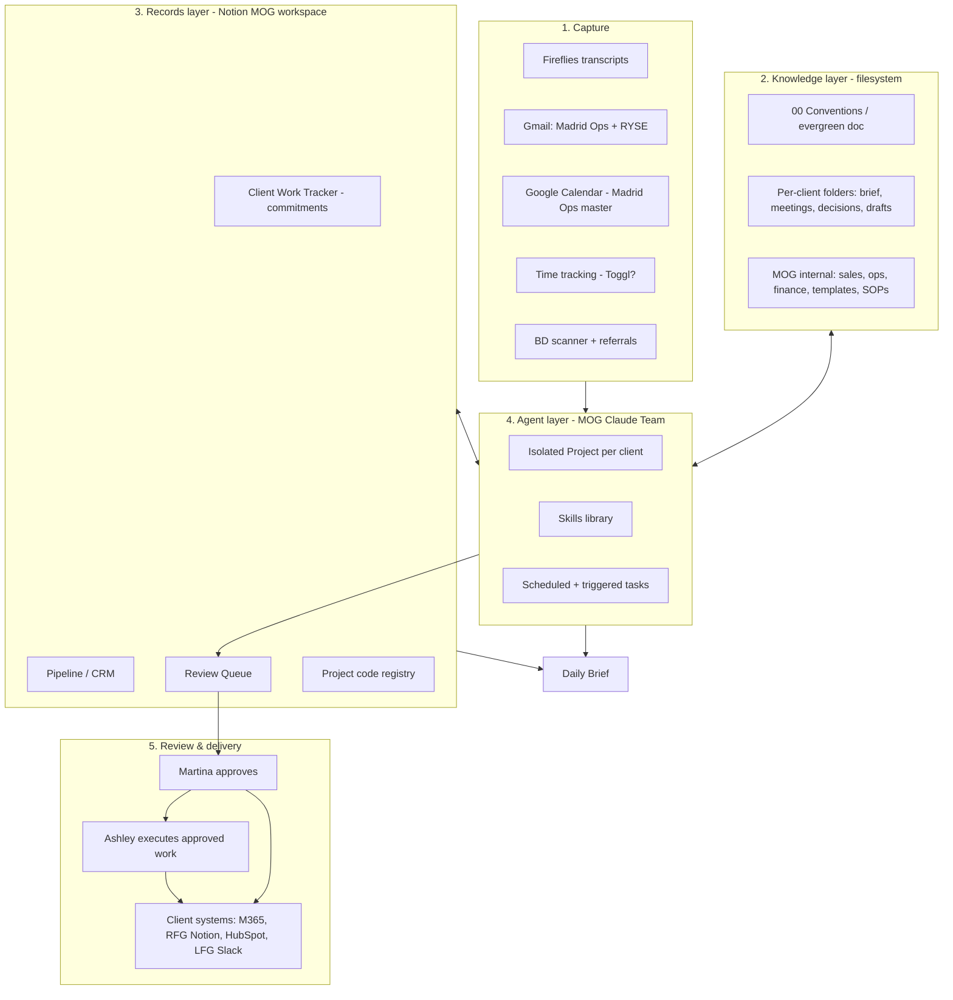

# AI-Native Stack Architecture: Madrid Operations Group

**Draft v0.1. Internal, not client-facing.**

## Summary
This is the first draft of the target architecture for MOG's AI-first rebuild. It sets out five layers:
1. **Capture**
2. **Knowledge** (a filesystem built around per-client folders)
3. **Records** (structured Notion databases)
4. **Agents** (the MOG Claude Team account, built to be AI-agnostic)
5. **Review & Delivery** (one draft-and-confirm queue that enforces Martina's human gates)

The most important early call was Google vs SharePoint. **It's decided: Google (D1, 2026-10-07)**, after a hands-on connector test. Much of this is direction rather than final design. The open decisions are listed explicitly near the end.

## Context
**Sources:**
- JC's long notes and comments in [[SOPs/20261007_MOG_First_Steps_Discovery]] (comments [a], [b], [p], [q], [t], [u], [w]).
- [[20261007_MOG_Current_State_Workflow_Map]].
- The 2026-10-07 call decisions, recorded in [[20260929_Madrid_Operations_Group_Client_Brief]].
- Blue Tusk product thinking:
  - [[business/projects/internal/product/20260814_information-taxonomy-offering-stack]]
  - [[business/projects/internal/product/20260816_ai-file-integration-capability-reality-check]]

**Why the product notes matter here.** MOG is a live, small-scale pilot of the Blue Tusk offering stack:
- **Layer 1 (taxonomy):** MOG's folder structure and project codes.
- **Layer 1.5 (skills + navigation files):** the evergreen doc and isolated Projects per client.
- **Layer 3 (draft-and-confirm working partner):** the review queue.
- **Flagship use case (meeting transcripts):** the AI chief of staff.

What we learn here should feed back into those notes. This is the reduced-price R&D value the SOW refers to.

---

## 1. Design principles

1. **Make the information legible before automating it.** Agents are only as good as the structure they read. The folder taxonomy, project codes and evergreen doc come first; the automations come after. Bad structure produces confidently wrong drafts and wasted tokens (taxonomy note, problem statement).
2. **Draft-and-confirm everywhere.** AI and Ashley prepare; Martina approves. This is how Martina wants to work (her non-negotiables). It also matches what the platforms can reliably do today (reality-check note). One review pattern covers every workflow, which keeps it learnable.
3. **AI-agnostic by construction.** Context lives in portable, human-readable files (client briefs, the conventions doc and skills as plain documents), and connections use open standards (MCP connectors). If MOG switched AI vendors tomorrow, the knowledge layer and records layer would carry over unchanged, and only the agent layer would need rewiring.
4. **Client isolation by structure.** Each client gets its own folder, its own project code and its own isolated AI Project. No agent task reads across clients. This satisfies Martina's confidentiality gate without scattering MOG's knowledge.
5. **Draft in MOG, deliver to the client.** MOG's system is where Claude has full context. Finished work is pushed into each client's own system. Martina's tools can't follow her into every client engagement, but her context can stay in one place.
6. **Built for multiple users from day one.** Martina, Ashley and Alexis are users now, and it should be easy to add an operator. Roles determine what each person and each agent can see and do.
7. **Every tool maps to a workflow.** A tool that doesn't serve a mapped workflow gets cancelled (P-003).
8. **Project codes are the shared key.** One code per engagement (MC, RFG, LFG-COO, LFG-LA, RYSE, AEQ, plus MOG-ADM and MOG-BD) runs through folders, tracker rows, file names, calendar events, hours and email labels. This is what lets the daily brief join data from different sources.
9. **Design for token cost from the start (added 2026-10-07).** Editing Google Docs is expensive: each index-based edit needs a structure read about 30–40x the size of the text, and one small edit with verification cost around 20K tokens in testing. Reading a Doc's text is cheap. So agents work in markdown, publish to Google Docs once, and edit published docs rarely and cheaply. MOG covers direct costs of about $200/month, and a workflow that constantly rewrites Google Docs would blow through that. Full numbers and rules: [[business/projects/internal/product/20261007_google-drive-taxonomy-test-results]] (Token cost section).

---

## 2. Architecture overview



---

## 3. The layers

### Layer 1: Capture
Where raw inputs enter the system. Nothing is processed here; inputs are only collected and tagged with a project code wherever possible.

| Source | What it captures | Feeds | Notes |
|---|---|---|---|
| Fireflies | Call transcripts | W1 close out, commitments, prep | Keep for now (see D4). A bot-free option exists. |
| Gmail (Madrid Ops, RYSE) | Client and prospect email | Inbox categorization, "what needs me," prep context | RYSE inbox is client-owned. Confirm what access is allowed. |
| Google Calendar (Madrid Ops master) | Calls, work blocks, deep work days | Daily brief, prep schedule, hours fallback | The master calendar is moving from RYSE now. Prerequisite for the daily brief. |
| Time tracking | Hours by project code | Cap check, invoicing (W2) | Toggl trial (D5). Until then, the calendar's all-day tallies. |
| BD scanner, referrals, BDR.ai replies | Leads | CRM | BDR.ai itself is out of scope; only its leads flow in. |
| LFG Slack | Client messages | "What needs me" | Client-owned. Read only. |

### Layer 2: Knowledge (filesystem)
This is the core of the design and the Layer 1 taxonomy work applied to MOG. It holds documents and context: anything an agent needs to read to understand a client or a process.

**Folder taxonomy: placeholder only. JC decides MOG's taxonomy before anything specific goes to Martina** (2026-10-07). Taxonomy is designed per client, so the tree below shows the kinds of things that need a home. It is not a recommendation yet.
```
MOG/
├── 00_Conventions/            ← evergreen doc: how MOG works, project codes, naming, where things live
├── 01_Clients/
│   ├── MC_Maycomb-Capital/
│   │   ├── 00_client-brief           ← living context: people, scope, cap, tools, AI policy, open items
│   │   ├── 01_meetings/              ← close-out notes, by date
│   │   ├── 02_decisions/             ← decision log
│   │   ├── 03_drafts/                ← AI and Martina drafts before delivery to client
│   │   ├── 04_delivered/             ← copies or links of what went to the client
│   │   ├── 05_reference/             ← templates and examples specific to this client
│   │   └── _ai/                      ← AI-only working folder: agent notes, context handoff, rough markdown drafts
│   ├── RFG_Ruthless-for-Good/
│   ├── LFG_LendForGood/              ← one folder, two codes (LFG-COO, LFG-LA)
│   ├── RYSE_RYSE-Creative/
│   └── AEQ_Aequilibria/
├── 02_Sales/                  ← prospects, proposals, SOW/MSA templates, case studies
├── 03_Operations/             ← SOPs, Ashley's hub material, team roles
├── 04_Finance/                ← invoice drafts, hours exports (no bank credentials, ever)
├── 05_Marketing/              ← LinkedIn drafts, website copy
└── 06_Events/                 ← convening and event service line (Alexis)
```

**Rules for the knowledge layer:**
- **What stays out of MOG's context folders:** client financials, client customers' data, personnel matters and anything under a client-specific AI restriction. This was agreed on the call. Example: LFG's rule of no lender or borrower financial data in AI.
- **The client brief is the anchor.** Every agent task for a client starts by reading that client's brief, the same pattern as Blue Tusk's own briefs. It is also what keeps the system AI-agnostic, since any AI can read a brief.
- **Close outs and decisions get appended, never scattered.** This fixes "next steps in four places."
- **AI working folder per client (JC idea, 2026-10-07).** An AI-only folder (name to be decided, e.g. `_ai/`) holds:
  - the agent's own notes
  - the client's context handoff snapshot (same pattern as JC's vault)
  - rough first drafts in **markdown**, while content is still being decided

  Agents draft and iterate there cheaply, then publish to a formatted Google Doc when content is settled. Nothing in `_ai/` counts as approved or delivered. Humans can read it.
- **Format:** see D2. Plain text or markdown is the most AI-agnostic and the cheapest in tokens; Google Docs or Word is easier for Martina and Ashley to edit.

**Platform: Google Drive (decided 2026-10-07, D1).** It sits in a MOG shared drive. Agents work from folder IDs, not full-text search; see [[business/projects/internal/product/20261007_google-drive-taxonomy-test-results]].

### Layer 3: Records (Notion MOG workspace)
Structured data that has states, owners and dates belongs in databases, not documents. Notion stays: Martina already pays for it, Ashley's hub lives there, Martina likes it, and Notion AI can build the CRM quickly.

| Database | Purpose | Status |
|---|---|---|
| Project code registry | One row per engagement: code, client, cap, period, billing rule (e.g. MC overage billable), tools, AI policy | New. Small, but everything else references it. |
| Client Work Tracker | Commitments and next steps, by code, owner and due date | Exists. Restructure around codes and AI-generated commitments. |
| Pipeline / CRM | Contacts, deals, last touch, follow-up date | Exists in name only. Quick win (P-007). Needs the contact export. |
| Review Queue | Every AI draft awaiting Martina: type, code, link, due-by, status | New. The single human-gate inbox (see Layer 5). |
| Executive Assistant Hub | Ashley's SOPs, Delegation Board, The Handoff | Exists. Keep, and update as Ashley's role changes. |
| LinkedIn content DB, BD Scanner Queue | Content pipeline; incoming leads | Exist. Keep. The scanner feeds the CRM. |

**Notion caveat:** the pain of switching the connector between the MOG and RFG workspaces stays as long as RFG work happens in RFG's Notion. That's expected, since RFG's workspace is client-owned. The fix is to do RFG drafting in MOG's RFG folder and push the finished work to RFG's Notion. That cuts down on switching but doesn't remove it entirely.

### Layer 4: Agents (MOG Claude Team account, AI-agnostic)
- **Isolated Project per client.** Each client Project loads the MOG evergreen doc plus that client's brief and folder path. This is the Layer 1.5 pattern from the taxonomy note. It saves tokens (agents don't search the whole drive) and enforces client isolation. Ashley and Alexis can create a new Project from a template when a client is onboarded (W4).
- **Skills library.** Migrate Martina's existing skills into the Team account:
  - RFG agenda and recap
  - LFG standups
  - Maycomb notes
  - LFG SOPs and loan trackers
  - Hours tracker
  - LinkedIn posts
  - HubSpot task updater

  Then add new ones: close out to commitments, prep packet, client check-in draft, invoice draft, proposal/SOW from the conversation history. Skills are written as plain documents, which keeps them portable.
- **Scheduled tasks:**
  - Daily brief, every morning, shorter on deep work days.
  - Close out for recurring meetings.
  - Prep packets the day before each call.
  - CRM follow-up reminders.
  - Weekly hours roll-up.
- **Triggered tasks:** close out for one-off meetings, onboarding setup, invoice draft at month end.
- **Inbox categorization.** JC's comment [a] suggests running this outside the Team plan, through the API with a small model, to save plan tokens and scale to more people. To be decided (D7).
- **AI-agnostic guardrails:** all context lives in Layers 2 and 3, not in chat history or platform memory. Prompts and skills are stored as files. No logic exists only inside a vendor-specific feature unless it has a documented equivalent. A local model was floated on the call as a long-term option if scheduled runs grow, and it isn't in scope now.
- **Agent behavior rules from the Google test (2026-10-07):**
  - **Folder-scoped access only.** Full-text search covers the whole Drive, including other clients, so agents never rely on it to find client files.
  - **Keep the IDs of files just created.** Search doesn't index new files right away.
  - **Label agent comments and replies with a prefix** (e.g. "🤖 Claude:"). Connectors post under the connected person's name.
  - **Act on comments only from approved people** (Martina, Ashley, Alexis, JC), and confirm anything outside the doc.
  - **Read comments through the Drive connector,** not the Docs reader.

### Token-cost rules for agents working in Google (added 2026-10-07)
| Rule | What it means in MOG's workflows |
|---|---|
| **Markdown first** | Close outs, prep packets, check-in drafts, proposals and SOP drafts are all drafted and revised in the client's `_ai/` folder as markdown. |
| **Publish once** | A formatted Google Doc is created (cheaply, by HTML upload) only when content is ready for people: a final SOP, a deliverable, a brief Martina reads. |
| **Edits that need no read come first** | Edits to published docs use find-and-replace of a unique phrase, or append at the end of the doc. Neither needs a structure read. |
| **Logs add entries at the bottom** | Agent-maintained running docs add new entries at the end, which needs no read, rather than at the top. This replaces "newest at top." |
| **High-frequency data stays out of formatted Docs** | Commitments go to the Notion Client Work Tracker. Hours and caps go to a Sheet or Notion, where adding rows is cheap. The working decision log and handoff stay in markdown in `_ai/`. A client-facing decision log, if needed, is republished at milestones. |
| **One structure read per doc per task, at most** | When an index-based edit is unavoidable (e.g. suggestion-mode changes for Martina's review), batch all changes into one read and one write. |
| **Verify cheaply** | Confirm edits with a text read (~1x), never a second structure read. |
| **Suggestion mode only at the end** | Used for the final human review of a published doc. Never for iterating. |
| **Republish at milestones** | If a published doc needs a heavy rewrite, publish a new version and archive the old one rather than making many edits. The link changes, so only do this at version boundaries. |

**Workflow impact:**
- **W1 close out:** written as markdown in `_ai/`. Commitments go to the Notion tracker. A human-facing meeting note is published only if the client format needs one.
- **The daily brief:** read-only and built from cheap reads (Notion, Calendar, text reads). It never edits Docs.
- **The comment loop:** used only for occasional, targeted requests on published docs, never as the main editing channel.

### Layer 5: Review & delivery
**One pattern for every workflow:** draft → Review Queue → Martina approves or edits → the approved item is executed. This is draft-and-confirm made concrete.

**Suggestion mode makes this work inside the document (tested 2026-10-07).** An agent can make its changes as tracked suggestions in an existing Google Doc. The Review Queue item then points at the doc, and Martina accepts or rejects the changes in Google Docs itself. The same applies to comments: Martina leaves a comment, the agent does what it asks and replies in the thread, and Martina reviews the result. One quirk to expect: a new paragraph added right after a heading shows up as two suggestions (the text and a formatting change). Martina should accept both or use "Accept all."

| Gate (Martina's non-negotiables) | Who drafts | Who approves | Who executes after approval |
|---|---|---|---|
| Client, prospect and partner communication | Agent / Ashley | Martina | Martina sends (her rule: "sends are mine") |
| Invoices, pricing, scope changes, payments | Agent / Ashley | Martina | Martina or Ashley sends invoices, per Martina's preference `[TO CONFIRM]` |
| Calendar conflicts | Agent / Ashley flags | Martina | Ashley |
| LinkedIn, website, marketing | Agent | Martina | Ashley may publish after review (JC's comment [b]) |
| Transcript facts going into client records | Agent | Martina, checked against the full transcript | Agent files it |
| Sensitive topics (personnel, legal, client finances) | Not drafted by agents | Martina only | Martina |

**Delivery into client systems** is a manual or semi-manual step at first: copy into the client's M365 or Google environment, RFG's Notion, HubSpot or LFG Slack. This is acceptable. Automating delivery into client-owned systems requires each client's permission and their own connectors, so it's out of scope for v1.

**Client Claude accounts.** Martina can't have two Claude accounts open at once. Using a separate browser profile for each client account (and keeping the MOG Team account in the desktop app) should solve this without a second computer. `[TO CONFIRM with Martina]`

---

## 4. Workflow-to-stack mapping

| Workflow | Capture | Knowledge | Records | Agent | 🔒 Gate |
|---|---|---|---|---|---|
| W1 Meeting lifecycle | Fireflies, Calendar | Client brief, meetings, decisions | Client Work Tracker | Prep packet (scheduled), close out (scheduled or triggered), commitments extraction | Transcript facts; check-ins before sending |
| W2 Time & invoicing | Toggl or Calendar | 04_Finance | Project code registry (caps, billing rules) | Weekly roll-up, cap flags, invoice drafts | Every invoice |
| W3 BD & sales | Scanner, referrals | 02_Sales templates, client history | CRM | Follow-up reminders, buildout-filter first pass, proposal/SOW drafts | Pricing, every send |
| W4 Onboarding | Signed SOW | New client folder from template | New registry row | Setup checklist, new Project from template | Communication norms set by Martina |
| W5 Inbox & calendar | Gmail, Calendar | Conventions (categories = project codes) | Review Queue for "needs Martina" | Inbox categorization | Calendar conflicts |
| W6 LinkedIn | Pillar topics | 05_Marketing | LinkedIn DB | Draft posts | Publishing |
| W7 Delegation to Ashley | n/a | 03_Operations SOPs | EA Hub | Every new build ships with an SOP | n/a |
| W8 Events (Alexis) | Event client calls | 06_Events | Registry row per event project | Same W1 pattern | Same gates |
| **Daily brief** | Calendar, Gmail, Slack | n/a | Tracker, CRM, registry, Review Queue | Scheduled morning task | n/a (read-only output) |

---

## 5. Tool decisions (current state → target)

| Tool | Decision | Reason |
|---|---|---|
| Claude Team (MOG) | **Keep: build home** | Decided on the call |
| Notion (MOG workspace) | **Keep: records layer** | Already paid; Ashley's hub; fast CRM build |
| Google Workspace | **Keep: filesystem (D1 decided)** | Both prefer it; passed the 2026-10-07 connector test |
| Fireflies | **Keep, evaluate (D4)** | Works; bot-free option; "whatever serves the system" |
| QuickBooks Online, Wise, Chase | **Keep** | Bookkeeping isn't being rebuilt. The Wise-to-QBO matching is a later automation or an accounting-service question (P-009). |
| Toggl | **Evaluate (D5)** | Suggested on the call; free tier |
| BDR.ai, Selling.com | **Out of scope** | Marketing/outreach is a separate scope. Only their leads feed the CRM. |
| Canva | **Out of scope** | Branded materials are excluded in the SOW |
| Client-owned tools (HubSpot, LFG Slack, RFG Notion, Affinity, Asana, client M365) | **Delivery targets only** | Not MOG's to change |
| Other AI subscriptions | **Audit** | Cancel anything that doesn't map to a workflow. Costs needed (open question in the brief). |

---

## 6. Capability check: confirmed by hands-on test (2026-10-07)

The August note concluded that Google Drive was "create-new only, no in-place editing." A hands-on test in the Blue Tusk shared drive replaced that conclusion. Full results: [[business/projects/internal/product/20261007_google-drive-taxonomy-test-results]].
- ✅ **Shared drive** read and write.
- ✅ **Native Google Docs and Sheets** created (no .docx); `.md` files kept as markdown.
- ✅ **Edits an existing doc in place**, targeted and locked to the version just read.
- ✅ **Suggestion mode** (tracked changes). New paragraphs after a heading show up as two suggestions.
- ✅ **Comment loop:** reads a comment, does what it asks, replies in the thread.
- ⚠️ **Full-text search** covers the whole Drive and doesn't index new files right away. Agents use folder IDs instead.
- ⚠️ **Agent actions show under the connected person's name.** Agents use a label prefix.

**What this means:** D1 is decided as Google. Draft-and-confirm can now happen inside documents through suggestion mode, not only through separate draft files. The August note has been updated.

---

## 7. Open decisions

| # | Decision | Options | Leaning | Needed by |
|---|---|---|---|---|
| D1 | Filesystem platform | Google Drive vs SharePoint | **Decided 2026-10-07: Google Drive** (passed the connector test) | Done |
| D2 | Knowledge file format | Google Docs vs markdown vs mixed | **Mixed, split by audience:** markdown for AI work (the `_ai/` folder: notes, handoff, rough drafts), formatted Google Docs for anything people read or receive. Draft in markdown, publish to Docs once content is settled, then use targeted edits or suggestions. | Phase 0 |
| D3 | Where the Review Queue lives | Notion database vs a Drafts folder with a status field | Notion (has states, owners and dates; Ashley already works there) | Phase 1 |
| D4 | Meeting notes tool | Fireflies vs Notion meeting notes vs other | Keep Fireflies unless it limits the close-out build | Phase 2 |
| D5 | Time tracking | Toggl (auto or manual) vs calendar tallies plus Claude | Toggl trial | Phase 1 |
| D6 | Client Claude accounts | Browser profiles vs second machine vs keeping work in MOG's account | Browser profiles | Now (cheap to try) |
| D7 | Inbox categorization runtime | Team plan scheduled task vs API with a small model | API, if volume justifies it | Phase 3 |
| D8 | Local model hosting | Not now | Revisit if scheduled-run costs grow | Post-retainer |
| D9 | **Storage for the `_ai/` folder (agent notes, handoff, markdown drafts). UNRESOLVED; JC flagged the cost concern** | A: real `.md` in Drive, replaced on each change · B: plain Google Doc, cheap edits only (current workaround) · C: Notion pages · D: Drive desktop sync + Claude Code/Cowork · E: custom MCP server for Drive markdown · F: GitHub repo | **Interim: B**, with find-and-replace, append at the end and text reads only. JC doesn't love it: real `.md` files can't be edited in place in Drive, and Google Doc structure reads cost ~8K+ tokens even for tiny docs. **Revisit before the build relies on `_ai/` heavily.** Details: [[business/projects/internal/product/20261007_google-drive-taxonomy-test-results]] (UNRESOLVED section). | Before Phase 2 |

---

## 8. Build phases (fit to the retainer term, Sep 29 – Dec 29)

| Phase | Weeks | What | Depends on |
|---|---|---|---|
| 0. Foundations | 2–4 (Oct) | MOG shared drive in Google (D1 decided), folder taxonomy, evergreen conventions doc (including the agent rules from the test), project code registry, a client brief for each code, Claude Team set up with isolated Projects, skills migrated | Martina's sign-off on the taxonomy |
| 1. Quick wins | 2–4 (in parallel) | CRM with follow-up cadence, v1 daily brief (scheduled task), Toggl trial, Review Queue | Contact export; Madrid Ops calendar as master |
| 2. AI chief of staff | 4–8 | W1 end to end: prep packets, close outs, commitments into the tracker, check-in drafts | Phase 0 (briefs, codes); D4 |
| 3. Hours → invoices | 6–9 | Weekly roll-up, cap flags, invoice drafts; inbox categorization | Toggl decision; billing rules in the registry |
| 4. Team enablement | 8–12 | SOPs for each new process, Ashley's redefined role and KPIs, Alexis onboarded, template for adding an operator | Phases 2–3 running |
| 5. Events service line | As engagements land | W8 mapped onto the same pattern | First event engagement (October) |

> Pacing note: the SOW lets Blue Tusk deprioritize this work behind higher-paying clients. Phases 0–1 are the ones to protect, because they give Martina visible relief and everything else builds on them.

---

## 9. Feedback into the Blue Tusk offering stack
Things to watch here and carry back to the product notes:
- How long the taxonomy design (Phase 0) actually takes for a small firm. This informs Layer 1 pricing.
- Whether isolated Projects per client measurably cut token use and errors. This validates the Layer 1.5 claim.
- How smooth draft-and-confirm is in practice for a non-technical principal and an EA. This is the core Layer 3 question.
- The Google editor-connector test results, for an updated reality-check note.

## Next steps
- [x] Run the Google test and decide D1. **Done 2026-10-07: Google.**
- [ ] Turn Phases 0–1 into the build plan for Martina, due Monday, Oct 12. Include the logins and data exports needed.
- [ ] Draft the evergreen conventions doc and project code registry. Start from the Taxonomy Test `CONVENTIONS.md` and add the agent rules.
- [ ] Ask Martina to try separate browser profiles for client Claude accounts (D6).
- [x] Update the August capability reality-check note. **Done 2026-10-07.**
- [ ] Run the Claude Project isolation test in the Taxonomy Test folder.
