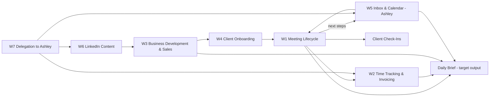

# Current State Workflow Map: Madrid Operations Group

**Blue Tusk | AI-First Retainer | Discovery Artifact**

> **Purpose.** This map shows how Madrid Operations Group runs today (the current state), so the AI-first rebuild can be designed from the what and the why rather than from the current tools. Each workflow is one left-to-right spine of core steps. Each core step carries the standard field set: **Inputs**, **Where inputs come from**, **Software & tools**, **Who is responsible**, **Outputs**, **Where outputs go**, and **Notes**.
>
> **Sources.**
> - [[SOPs/20261007_MOG_First_Steps_Discovery]]: Martina's completed discovery doc and both sets of comments.
> - The 2026-10-07 call walking through that doc.
> - [[20260929_Madrid_Operations_Group_Client_Brief]] for background.
>
> MOG has no written SOPs for these workflows yet, so Martina's own descriptions take the SOP's place.
>
> **How this differs from a client map.** Because MOG is being rebuilt from scratch, the tools in each step are a record of today, not something to preserve. Two things carry forward into the new system: the reasons and the human gates. The reasons are the "why it matters" column. The human gates are Martina's non-negotiables, marked 🔒.
>
> **Annotation layers:**
> - **⚠** marks known friction. Martina flagged several steps as "still done more manually than I'd like."
> - **`[TO CONFIRM]`** marks something not stated or inconsistent. These items double as the checklist at the end.
> - ***(Call)*** marks a detail from the 2026-10-07 call that isn't in the doc.
> - **🔒** marks a human gate from Martina's non-negotiables. These must survive the rebuild.
> - **→ Rebuild** marks JC's direction from his comments and the call. It is the current intent, not a final design.

---

## Legend

- **Core Step:** a node on the horizontal spine.
- **→** sequence or hand-off to the next step.
- **Field set:** Inputs, Where inputs come from, Software & tools, Who is responsible, Outputs, Where outputs go, Notes.

---

# Workflow Index

| # | Workflow | Spine (core steps, left → right) | Final deliverable |
|---|---|---|---|
| 1 | Meeting Lifecycle (client delivery engine) | Prep → Call → Close Out → Next Steps to Tracker → Schedule Work → Execute → Check-In | Client work done on time, nothing said on a call lost |
| 2 | Time Tracking & Invoicing | Work Blocks → Daily Tally → Weekly Sync → Cap Check → Invoice Prep → Approve & Send → Payment & Reconcile | Scope protected, invoices paid and reconciled |
| 3 | Business Development & Sales | Lead Sources → Queue Review → Pipeline → Intro Call → Buildout Filter → Scope → Paid Discovery → Proposal → SOW + MSA | Signed engagement |
| 4 | Client Onboarding | Access → Cadence → Communication Norms *(no checklist yet)* | Client set up from day one |
| 5 | Inbox & Calendar Management (Ashley) | Inbox Triage → Flag to Martina; Calendar Queue → Conflict Flag → Martina Decides | Replies don't slip; deep work protected |
| 6 | LinkedIn Content | Pillar Topic → Draft → Martina Review → Publish | Warm inbound |
| 7 | Delegation to Ashley | Identify Task → Hand Off (Delegation Board / The Handoff) → SOP → Ashley Executes | Work off Martina's plate |
| 8 | Convening & Event Work with Alexis *(placeholder)* | Not yet mapped. First engagement likely starts in October | TBD |

### How the workflows connect

> **Hub.** W1, the Meeting Lifecycle, is where most of the business runs. It produces the next steps, the hours and the client updates that everything else depends on, and it is where Martina feels the most manual work (comments [c], [d] and [e]).

---

# Cross-Workflow Foundations

These are mapped once here rather than repeated on every spine.

### Engagements and shorthand
| Code | Engagement | Client-side tools | Billing note |
|---|---|---|---|
| LFG - COO | LendForGood, fractional COO | HubSpot, Slack, Google Docs (standup notes) | Pays in AUD and USD via Wise |
| LFG - LA | LendForGood, loan admin | HubSpot, Xero | Same as above |
| RFG | Ruthless for Good | Notion (separate workspace from MOG), Microsoft 365 | Hour cap |
| MC | Maycomb Capital | Affinity CRM, Slack, SharePoint, Microsoft 365 | **Only client where overage is billed** |
| RYSE | RYSE Creative | Asana | Hour cap. Martina's master calendar currently lives on RYSE and is moving to Madrid Ops |
| Aequilibria | Aequilibria | `[TO CONFIRM]` | Hour cap |
| MOG Admin / MOG BD | Internal time buckets | n/a | Not billed |

> `[TO CONFIRM]` The brief's roster lists the San Antonio venue client and Panorama (prospect). The doc lists RYSE Creative and Aequilibria instead. Is the San Antonio client the same as Aequilibria (the HOT Filing SOP points that way, since hotel occupancy tax was the San Antonio work)? Is the San Antonio client still active?

### People
| Person | Role | Capacity |
|---|---|---|
| Martina Madrid Sebring | Founder & Principal; all client delivery; sole approver | Starts 6am; hard start/stop set by green Inbox blocks; deep work days at Kiln (`[TO CONFIRM]` Mon/Wed in Section 1, Mon/Thu in Section 6) |
| Ashley D. | Executive assistant through Time etc; ashley@madridops.com | About 25–35 hrs/month, fractional |
| Alexis Madrid | Business partner; convening and event work | Joining as event engagements land |
| Jenelle Friday | Runs BDR.ai campaigns with Martina (external) | Monthly numbers review |

### Tools in MOG's own stack today
| Tool | Current role |
|---|---|
| Notion (MOG workspace) | MOG Operating System hub: Client Work Tracker, Pipeline Tracker, LinkedIn content DB, BD Scanner Queue, Executive Assistant Hub (SOPs, Delegation Board, The Handoff) |
| Google Workspace | Gmail, Calendar (5 calendars shared with Ashley), Drive, Sheets (hours sheet) |
| Fireflies | Call transcripts feeding every close out |
| Claude | Skills for RFG agenda/recap, LFG standups, Maycomb notes, LFG SOPs and loan trackers, weekly hours tracker, LinkedIn posts. ***(Call)*** Martina just opened a **MOG Claude Team account** and prefers building there. |
| QuickBooks Online, Wise, Chase | Bookkeeping, AUD/USD receipts, banking |
| BDR.ai | LinkedIn outreach, about $3,500/yr prepaid |
| Selling.com | ICP-based prospecting |
| Canva | Design |

### Where information lives today, and why that matters
- **Next steps are in four places:** Fireflies, Notion, Google Docs and email. Martina lists this as a frustration.
- **Client deliverables live in each client's own system** (Google, then Microsoft 365 at LFG and Maycomb; Notion at RFG). Some internal client documents sit in Martina's personal drive. ***(Call)***
- **Each client has its own Claude account**, and Martina can't keep two Claude accounts open at once. Some client Claude work therefore happens in her own Claude. She is considering a second computer. ***(Call)***
- **The Notion connector has to be switched by hand** between the MOG and RFG workspaces.

### 🔒 Human gates (carry into every rebuilt workflow)
1. **Client communication:** drafts are fine, but Martina does every send, to clients, prospects and partners alike.
2. **Money:** Martina approves pricing, rates, scope changes, outgoing invoices and all payments. Ashley preps but doesn't send.
3. **Calendar:** Ashley proposes and queues, then flags conflicts. Martina resolves them.
4. **Anything public:** LinkedIn, website and marketing are never published without Martina.
5. **Facts from transcripts:** names, dollar figures, attribution and decisions get checked against the full transcript before they go into a client record. ***(Call)*** Martina accepts trusting transcript-to-first-draft as long as she reviews it.
6. **Sensitive topics:** personnel, legal/compliance and client financial or customer data stay with Martina.
7. **Client confidentiality:** each client's information stays in its own space and never appears in another client's work.

### Decisions from the 2026-10-07 call
- **Centralized client context (resolves [r]/[s]).** Martina agreed that MOG's own system will hold a folder per client with that client's broader context (not financials or sensitive data). There will also be a general MOG folder. Drafts get written in MOG's system, where Claude has access, and are then pushed to the client's system. This satisfies the confidentiality gate because separation is by folder, and nothing is shared across clients.
- **"Build on it, not around it" (resolves [u]/[v]).** Martina is open to starting from a strong AI-first base. Existing trackers may look very different, but their data will be migrated. Existing Claude skills will probably be reused.
- **Build home:** the new MOG Claude Team account.
- **AI-agnostic design:** JC will build so any AI that supports connections can run it, not just Claude. A local machine running models was floated as a long-term option if scheduled runs grow.
- **Google vs SharePoint (resolves [w]/[x]).** Both prefer to stay in Google, and Martina is open to SharePoint if Google doesn't work well enough. JC is testing Google, and this is **not decided**.
- **Meeting notes tool:** whatever serves the system best. Fireflies is fine and has a bot-free option. Martina already uses Notion, which JC likes.
- **BDR.ai and marketing are out of scope.** A pipeline tracker/CRM is in scope.
- **Time tracking:** JC suggested **Toggl** (free tier, Claude connection, optional automatic tracking). Martina will look into it.
- **JC owes Martina** an update by **Monday, Oct 12** on what he plans to build and what it requires. He may need logins (Notion, etc.) later.

---

# Workflow 1: Meeting Lifecycle

**Spine:** `Meeting Prep (day before) → Call → Close Out (15 min after) → Next Steps to Client Work Tracker → Schedule Work Blocks → Execute Client Work → Client Check-In / Status Update`

**Why it matters (Martina):** "Nothing said on a call gets lost" and "Commitments only happen if they have calendar time."
**Frequency:** Every call, daily, across six engagements.

### Core Step 1: Meeting Prep
- **Inputs:** Open items, last conversation, and context on the person and subject.
- **Where inputs come from:** Prior meeting notes (in client-specific formats and locations), email, Fireflies transcripts, Client Work Tracker.
- **Software & tools:** Notion, Google Docs, Fireflies, email `[TO CONFIRM: exact sources pulled]`.
- **Who is responsible:** Martina.
- **Outputs:** Martina walks in knowing the open items.
- **Where outputs go:** Into the call. `[TO CONFIRM: is prep written down anywhere?]`
- **Notes:** Prep happens the day before. Prep time depends on the person and subject, not on call length.
- **⚠** Martina: "still done more manually than I'd like."
- **→ Rebuild:** AI gets access to every past conversation source plus the broader client strategy and drafts the prep. This depends on the per-client context folder.

### Core Step 2: Call
- **Inputs:** Prep, attendees.
- **Where inputs come from:** Step 1, calendar.
- **Software & tools:** Client's meeting platform; Fireflies records.
- **Who is responsible:** Martina.
- **Outputs:** Fireflies transcript and summary.
- **Where outputs go:** Fireflies.
- **→ Rebuild:** JC's comment [a] says Martina may need some retraining to say commitments out loud on calls, so the AI can capture them.

### Core Step 3: Close Out
- **Inputs:** Fireflies transcript.
- **Where inputs come from:** Fireflies.
- **Software & tools:** Claude skills: RFG weekly agenda and recap (Notion), LFG standup notes (Google Docs), Maycomb notes and decision log.
- **Who is responsible:** Martina.
- **Outputs:** Notes, decisions and next steps in each client's format.
- **Where outputs go:** RFG Notion; LFG Google Docs; Maycomb `[TO CONFIRM: location]`.
- **Notes:** Done within 15 minutes of each call.
- **🔒** Names, dollar figures, attribution and decisions are checked against the full transcript before they go into a client record.
- **⚠** "still done more manually than I'd like." Every client has a different format.
- **→ Rebuild:** Scheduled agent tasks for recurring meetings and triggered tasks for one-off meetings. Use one output format if possible; otherwise use a format that converts well to every client's format.

### Core Step 4: Next Steps to Client Work Tracker
- **Inputs:** Next steps from the close out.
- **Where inputs come from:** Step 3 output (spread across Fireflies, Notion, Google Docs and email).
- **Software & tools:** Notion Client Work Tracker.
- **Who is responsible:** Martina `[TO CONFIRM: or Ashley?]`.
- **Outputs:** Tracked commitments by client.
- **Where outputs go:** Client Work Tracker.
- **⚠** Next steps live in four places. This is the frustration Martina repeats most often.
- **→ Rebuild:** Commitments are generated automatically from meeting notes, with a quick human review so nothing is missed. Ashley gets access. Centralized **project codes** should persist across trackers, documents and communications. The Client Work Tracker may already have started this.

### Core Step 5: Schedule Work Blocks
- **Inputs:** Tracked next steps.
- **Where inputs come from:** Client Work Tracker.
- **Software & tools:** Google Calendar (Madrid Ops calendar).
- **Who is responsible:** Ashley places blocks. Martina approves conflicts.
- **Outputs:** Calendar time for each commitment.
- **Where outputs go:** Madrid Ops calendar.
- **Notes:** Done weekly, plus after big calls.
- **🔒** Ashley flags conflicts and doesn't resolve them.
- **⚠** "still done more manually than I'd like."

### Core Step 6: Execute Client Work
- **Inputs:** Work blocks and context.
- **Where inputs come from:** Calendar, client systems.
- **Software & tools:** Each client's own systems (see foundations).
- **Who is responsible:** Martina; Alexis on some work in the future.
- **Outputs:** Deliverables (see [[SOPs/20261007_MOG_First_Steps_Discovery]] Section 3).
- **Where outputs go:** The client's system.
- **⚠** Each client is in its own Claude account, and she can't run two at once.
- **→ Rebuild:** Draft in MOG's system with full client context, then push to the client's system. JC's comment [q] says templates come from a best-practice example where none exist. The system needs to be flexible, because each client has its own document types.

### Core Step 7: Client Check-In / Status Update
- **Inputs:** Progress against next steps.
- **Where inputs come from:** Client Work Tracker, recent contact notes.
- **Software & tools:** LFG Slack (daily check-in and end-of-day wrap), email.
- **Who is responsible:** Martina.
- **Outputs:** Status update to the client.
- **Where outputs go:** The client's channel.
- **Notes:** Daily to weekly, depending on the client.
- **🔒** Never sent without Martina's review.
- **⚠** Martina: "This is aspirational. Not doing it as consistently as I want."
- **→ Rebuild:** Generate drafts from the tracker and the latest notes. Possibly delegate to Ashley. Make it easy to add new clients.

---

# Workflow 2: Time Tracking & Invoicing

**Spine:** `Work Blocks on Calendar → Daily Tally (all-day event) → Weekly Sync to Hours Sheet → Cap Check / Overage Flag → Invoice Prep → Approve & Send → Payment Received → Reconcile in QuickBooks`

**Why it matters (Martina):** Scope integrity and cash flow. "I flag overages early instead of absorbing them."

### Core Step 1: Work Blocks on Calendar
- **Inputs:** Scheduled work (W1 Step 5).
- **Software & tools:** Google Calendar.
- **Who is responsible:** Ashley places blocks; Martina works them.
- **Outputs:** A calendar that reflects the hours worked.
- **Where outputs go:** Step 2.
- **⚠** Hours tracking depends on the calendar being accurate (a frustration Martina listed).

### Core Step 2: Daily Tally
- **Inputs:** The day's work blocks.
- **Software & tools:** Google Calendar.
- **Who is responsible:** Martina.
- **Outputs:** An all-day event per client, e.g. "MC: 2.25 hrs", rounded to the quarter hour. Includes MOG Admin and MOG BD.
- **Where outputs go:** Madrid Ops calendar.

### Core Step 3: Weekly Sync to Hours Sheet
- **Inputs:** Daily tallies.
- **Software & tools:** Google Sheets (hours workbook). ***(Call)*** Martina is testing Claude with the Chrome extension, reading her calendar and updating the sheet. A Claude weekly hours tracker skill exists.
- **Who is responsible:** Martina.
- **Outputs:** Weekly hours by client.
- **Notes:** Fridays.
- **→ Rebuild:** Toggl (automatic tracking, Claude connection) is under consideration. JC's view is that strict time tracking fits AI-leveraged work poorly. It is kept here because it protects scope.

### Core Step 4: Cap Check / Overage Flag
- **Inputs:** Weekly hours against each client's weekly or monthly cap.
- **Who is responsible:** Martina.
- **Outputs:** An early overage flag to the client. A billable overage for Maycomb only.
- **Where outputs go:** Client communication (🔒 Martina's review).
- **Notes:** This feeds the daily must-know "where each client sits against its cap."
- `[TO CONFIRM]` Each client's cap and period (weekly vs monthly).

### Core Step 5: Invoice Prep
- **Inputs:** Hours, retainer terms, project fees.
- **Software & tools:** QuickBooks Online `[TO CONFIRM: invoices built in QBO?]`; Invoicing SOP in the Executive Assistant Hub.
- **Who is responsible:** Ashley can prep.
- **Outputs:** Draft invoices.
- **Notes:** Monthly, plus per project.
- **⚠** Martina: "does not yet feel like a purposefully planned part of my monthly workflow. It seems to always sneak up on me."

### Core Step 6: Approve & Send
- **🔒** Martina approves every invoice before it goes out. Ashley doesn't send without sign-off.
- **Outputs:** Invoices sent to clients.

### Core Step 7: Payment Received & Reconcile
- **Inputs:** Client payments.
- **Where inputs come from:** Wise (LFG pays in AUD and USD), Chase.
- **Software & tools:** Wise, Chase, QuickBooks Online.
- **Who is responsible:** Martina.
- **Outputs:** Reconciled books.
- **⚠** Matching Wise deposits to QuickBooks is manual (a frustration Martina listed).
- **→ Rebuild:** Automatable. Hours feed invoices, and invoices get human review before they're sent. An accounting service is an option depending on cash flow.

---

# Workflow 3: Business Development & Sales

**Spine:** `Lead Sources → BD Scanner Queue Review → Promote to Pipeline Tracker → Intro Call → Buildout vs Management Filter → Scope → Paid Discovery (Diagnose) → Proposal Email → SOW + MSA → (W4 Onboarding)`

**Why it matters (Martina):** "Keeps the next engagement coming before the current one ends."

### Core Step 1: Lead Sources
- **Inputs and sources:**
  - **Relationships, which bring in almost all work:** Teach For America alumni (16+ yrs), RYSE and REVIVE 7, client referrals, Glue Club. Example: Panorama came through April Kennedy.
  - **Unpaid advisory favors**, which keep relationships warm.
  - **Outbound:**
    - BDR.ai LinkedIn campaigns with Jenelle. The campaign stops when someone replies, and Martina takes over and tags them as a lead or customer. ***(Call)***
    - Selling.com prospecting.
    - A BD scanner agent that sources leads against the MOG Master BDR.ai Workbook.
  - Considering LinkedIn events.
- **Who is responsible:** Martina. Ashley will handle BDR.ai replies once that's live.
- **⚠** Martina: "I was good about this when my client work was low/slow. Now I have zero time for this."
- **Scope note:** BDR.ai and marketing are **out of scope** for this engagement ***(Call)***.

### Core Step 2: BD Scanner Queue Review
- **Inputs:** Leads the scanner sources.
- **Software & tools:** Notion BD Scanner Queue.
- **Who is responsible:** Martina.
- **Outputs:** Real opportunities identified.

### Core Step 3: Promote to Pipeline Tracker
- **Inputs:** Opportunities from Step 2, plus referrals.
- **Software & tools:** Notion Pipeline Tracker.
- **Who is responsible:** Martina, promoting by hand.
- **⚠** Martina says what's missing is a Pipeline Tracker/CRM. There is no follow-up cadence.
- **→ Rebuild:** **Super high priority, and a quick win** (JC's comment [p]). Build a Notion CRM (Notion AI on Opus can build it), with follow-up reminders when a warm lead goes quiet. **It needs Martina's real contact data exported**, so the build doesn't use dummy data ***(Call)***.

### Core Step 4: Intro Call
- **Outputs:** An understanding of the problem.
- **Who is responsible:** Martina.

### Core Step 5: Buildout vs Management Filter
- **Rule:** Is it a buildout problem (a defined end state, with systems the client team will own) or a management problem (ongoing oversight that needs a full-time hire)? **Martina only takes buildout work.**
- **Notes:** This is a decision rule an AI could apply to a first-pass lead assessment. Martina makes the final call.

### Core Step 6: Scope
- **Rule:** Scope before price.

### Core Step 7: Paid Discovery (Diagnose phase)
- **Notes:** The front door for new retainers.

### Core Step 8: Proposal Email
- **Outputs:** Usually a short email with the number. Pricing is a value-anchored retainer, not hourly.
- **🔒** Pricing is approved and sent by Martina.

### Core Step 9: SOW + MSA (also LOIs)
- **Outputs:** Signed engagement → W4.
- **→ Rebuild:** AI gets access to every conversation source (same need as W1 prep). Templates and standardization are required.

---

# Workflow 4: Client Onboarding

**Spine:** `Set Access → Set Cadence → Set Communication Norms` *(provisional, since no checklist exists yet)*

**Why it matters (Martina):** "Sets access, cadence, and communication norms from day one."
**Status:** "No standard checklist yet."
- **→ Rebuild:** Use onboarding tools or custom forms. Standardize, while keeping the human element. Each new client also gets its own client context folder and a project code.
- `[TO CONFIRM]` What onboarding looked like for the most recent client (Aequilibria?). This would give a starting draft of the checklist.

---

# Workflow 5: Inbox & Calendar Management (Ashley)

**Spines:**
- `Inbox Triage (Madrid Ops + RYSE inboxes) → Flag "needs Martina" items`
- `Calendar Queue → Conflict Flag → Martina Decides`

**Why it matters (Martina):** Keeps client and prospect replies from slipping, and protects deep work days and hard start and end times.
- **Who is responsible:** Ashley, daily, under the Inbox SOP and Scheduling SOP (Executive Assistant Hub).
- **Calendars:** five are shared with Ashley. The master calendar is moving from RYSE to Madrid Ops, and all work blocks and duplicated client invites live on Madrid Ops.
- **🔒** Ashley flags conflicts and doesn't resolve them.
- ***(Call)*** Martina wants Ashley to "own" her calendar the way Martina owned a VP's calendar as an assistant. Ashley's fractional hours limit this, and Martina wants an AI layer to help fill the gap.
- **→ Rebuild:**
  - Scheduled inbox categorization by active project and prospect. It may be better built outside the Claude plan, to save tokens and to scale to more people.
  - Calendar apps like Motion are an option, though JC is fine with Ashley handling it.
  - Ashley's role is expected to change a lot.

---

# Workflow 6: LinkedIn Content

**Spine:** `Pillar Topic → Draft (Claude LinkedIn skill) → 🔒 Martina Review → Publish`

- **Pillars:** knowledge management, executive onboarding, COO search, fractional operations, scope integrity.
- **Tools:** Notion LinkedIn content database; Claude LinkedIn post skill.
- **Frequency:** Weekly, as a target.
- **⚠** Martina: "zero time for this." She is trying to get Ashley to take on more of it.
- **→ Rebuild:**
  - AI drafts. Martina reviews, and Ashley publishes after review.
  - Full automation is possible but could hurt trust.
  - Lead magnets are probably out of scope.

---

# Workflow 7: Delegation to Ashley

**Spine:** `Identify Task → Hand Off (Delegation Board / The Handoff) → SOP in Executive Assistant Hub → Ashley Executes → Weekly Review`

- **Why it matters (Martina):** "She can only take what is clearly handed off."
- **Existing SOPs:** How We Work, Scheduling, Inbox, Invoicing, Capacity & Priority.
- **→ Rebuild:**
  - Every new process ships with an SOP.
  - Add KPIs for Ashley's work.
  - Her role will be redefined during the build.
  - Alexis and future operators use the same system.

---

# Workflow 8: Convening & Event Work with Alexis *(PLACEHOLDER)*

- **Status:** A new service line. The first likely engagement starts in October (Panorama Education pursuit: "Panorama RKO 2027" estimate sent).
- **What we know:** Delivered by two principals. The system has to handle project-based event work alongside retainers. No event operations plan has been delivered yet.
- **→ Rebuild:** This needs project management plus understanding of the client's needs, drawing on the same conversation sources and internal documents as W1.
- **Next step:** Map it once the first engagement is running.

---

# Target Output: The Daily Brief

This isn't a workflow. It's the main thing the rebuilt system should produce every morning (Martina's daily must-knows):
- **Today's calendar:** which calls need prep today for tomorrow, and which close outs are still open (from W1).
- **Next steps due or overdue,** by client (from W1).
- **Hours check:** yesterday's tally and each client's position against its cap, with a flag when one is close to going over (from W2).
- **What needs Martina:** client messages waiting on a reply (email, LFG Slack) and anything Ashley has flagged (from W5).
- **Pipeline pulse:** new scanner leads and quiet deals (from W3).
- **Money:** invoices outstanding or due this week (from W2).
- **Deep work days:** the brief is shorter and focuses on building, not calls.

→ JC's comment [t]: this can start now with Claude scheduled tasks and could become a dashboard later. The `morning` skill pattern may apply.

---

# Cross-Workflow Observations

1. **Fragmented next steps cause most of the pain.** Three of Martina's "more manual than I'd like" flags (prep, close out, scheduling) and her biggest frustration all trace back to commitments spread across four tools. Centralizing per-client context and using project codes fixes W1, and feeds W2, W5 and the daily brief.
2. **Account and workspace switching is a structural cost.** Juggling multiple Claude accounts, switching the Notion connector between workspaces, and working in each client's own filesystem all slow Martina down. The agreed model (draft in MOG's system, push to the client's) addresses this directly.
3. **Work that matters gets skipped when client load rises.** BD, LinkedIn and client check-ins were consistent when work was slow and drop off when it's busy. These are the best candidates for AI drafts plus Ashley execution behind Martina's review gate.
4. **The human gates are clear and consistent.** Every gate is "AI and Ashley prepare, Martina approves." The rebuild can follow one pattern everywhere: draft → review queue → Martina sends.
5. **Quick wins already identified:**
   - Pipeline CRM with follow-up cadence (W3 Step 3).
   - Daily brief via scheduled task.
   - Toggl trial for time tracking (W2).

---

# `[TO CONFIRM]` Checklist

**Foundations**
- Deep work days: Mon/Wed or Mon/Thu?
- Client roster: San Antonio client vs Aequilibria (same client?); is San Antonio still active?
- Each client's hour cap and period (weekly vs monthly).
- Google vs SharePoint decision, after JC's Google testing.
- Data export from the existing Notion Pipeline Tracker / contacts, for the CRM build.
- Logins needed for the build (Notion, etc.). JC to list them in the Monday update.

**W1 Meeting Lifecycle**
- Exact sources Martina pulls for prep; whether prep is written down anywhere.
- Where Maycomb notes and the decision log live.
- Who enters next steps into the Client Work Tracker: Martina or Ashley?

**W2 Time & Invoicing**
- Are invoices built in QuickBooks Online or elsewhere?
- Outcome of the Toggl trial.

**W4 Onboarding**
- A recent onboarding example, to draft the checklist from.

---

*End of current-state map. Source document: [[SOPs/20261007_MOG_First_Steps_Discovery]]. Next artifact: the build plan for Martina, due Monday, Oct 12.*
